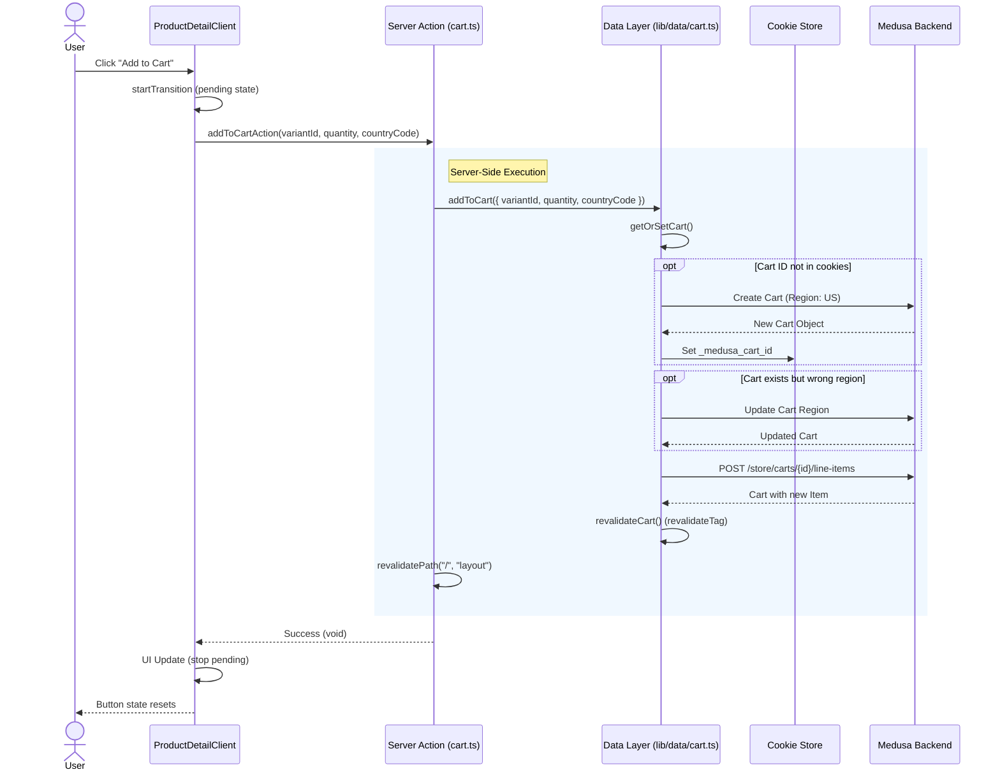

# DJI Storefront: Add to Cart Execution Flow

This document outlines the detailed execution flow and underlying logic of the "Add to Cart" functionality in the DJI Storefront application (`apps/dji-storefront`).

## Architecture Overview

The "Add to Cart" feature spans three main architectural layers:
1.  **Client-Side UI**: React components handling user interaction.
2.  **Server Actions**: Next.js Server Actions bridging client and server.
3.  **Data Layer**: SDK integration with the Medusa backend.

## Execution Flow

The following sequence diagram illustrates the complete process from the user clicking the button to the UI update.



## Detailed Code Analysis

### 1. UI Component: `ProductDetailClient`
**File:** `apps/dji-storefront/src/components/products/product-detail-client.tsx`

The client component manages the user input (quantity, variant selection) and triggers the server action.

*   **State Management**: Uses `useTransition` to handle the loading state (`isPending`), providing immediate feedback (disabling the button, showing "Adding...").
*   **Trigger**: The `handleAddToCart` function wraps the server action call.
*   **Error Handling**: Basic `try/catch` block logging errors to the console.

```typescript
const handleAddToCart = () => {
  if (!variant?.id) return
  startTransition(async () => {
    try {
      await addToCartAction({ variantId: variant.id, quantity, countryCode: resolvedCountryCode })
    } catch (error) {
      console.error("Add to cart failed", error)
    }
  })
}
```

### 2. Server Action: `addToCartAction`
**File:** `apps/dji-storefront/src/app/actions/cart.ts`

This is the bridge between the client and the backend logic.

*   **Responsibility**: Calls the data layer and triggers a global UI refresh.
*   **Revalidation**: Crucially calls `revalidatePath("/", "layout")`. This forces Next.js to re-render the root layout, which typically contains the **Cart Counter** in the header, ensuring it reflects the new item count immediately.

```typescript
export async function addToCartAction(...) {
  await addToCart({ variantId, quantity, countryCode })
  revalidatePath("/", "layout") // Updates header cart count
}
```

### 3. Data Layer: `addToCart` & `getOrSetCart`
**File:** `apps/dji-storefront/src/lib/data/cart.ts`

This layer contains the core business logic and Medusa SDK interactions.

#### Logic: `getOrSetCart`
Before adding an item, the system ensures a valid cart exists.

```mermaid
flowchart TD
    A[Start] --> B{Get Cart ID from Cookie}
    B -- Found --> C[Retrieve Cart from Medusa]
    B -- Missing --> D[Create New Cart (Region: US)]
    C -- Success --> E{Check Region}
    C -- Failed --> D
    E -- Match (US) --> F[Return Cart]
    E -- Mismatch --> G[Update Cart Region]
    D --> H[Set Cookie] --> F
    G --> F
```

*   **Cookie Handling**: Uses `getCartId()` and `setCartId()` from `@/lib/server/cookies` to persist the session.
*   **Region Enforce**: Currently hardcoded to enforce the `US_REGION_ID`. If a user comes with a cart from a different region, it is updated.

#### Logic: `addToCart`
Once the cart is secured:
1.  **SDK Call**: Uses `sdk.store.cart.createLineItem` to add the product variant.
2.  **Caching**: Calls `revalidateCart()`, which triggers `revalidateTag(cartTag)`. This updates the Next.js Data Cache for any queries relying on cart data (e.g., the cart dropdown or checkout page).

## Key Mechanisms

### Cart Identification (Cookies)
The cart ID is stored in a secure, HTTP-only cookie (typically named `_medusa_cart_id`). This allows the user's cart to persist across sessions and page reloads.

### Dual Revalidation Strategy
The system uses two levels of cache invalidation:
1.  **`revalidateTag` (Data Cache)**: Invalidates the specific cached API response for the cart. Used by `retrieveCart` calls.
2.  **`revalidatePath` (Router Cache)**: Triggered in the Server Action. Tells Next.js to re-render the component tree (specifically the layout), ensuring the UI (header badge) fetches the fresh data.

### Region Handling
The current implementation has a "Plan A" logic that forces the US region:
```typescript
// apps/dji-storefront/src/lib/data/cart.ts
if (cart.region_id !== US_REGION_ID) {
  // Update to US region
}
```
This simplifies cross-border complexity for the initial MVP by unifying pricing and currency.
