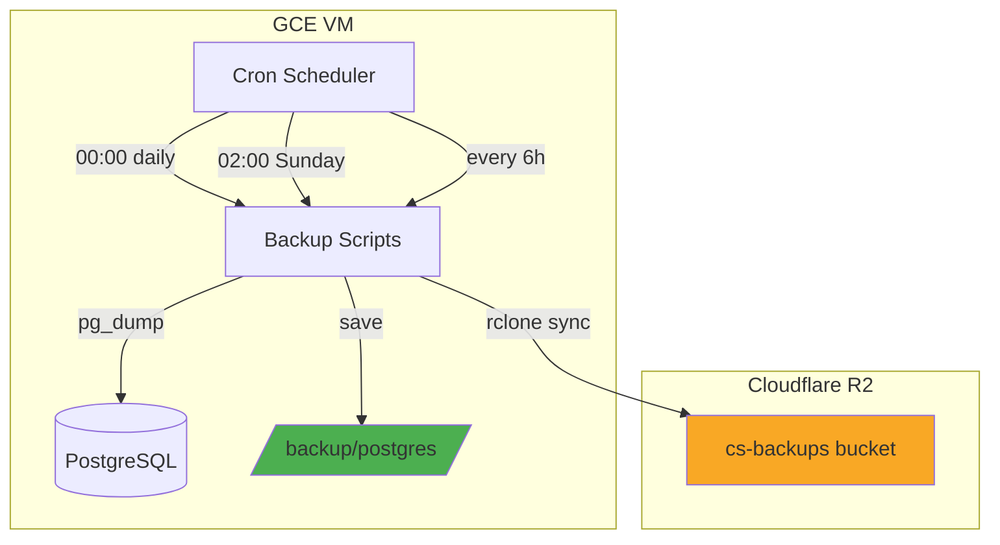
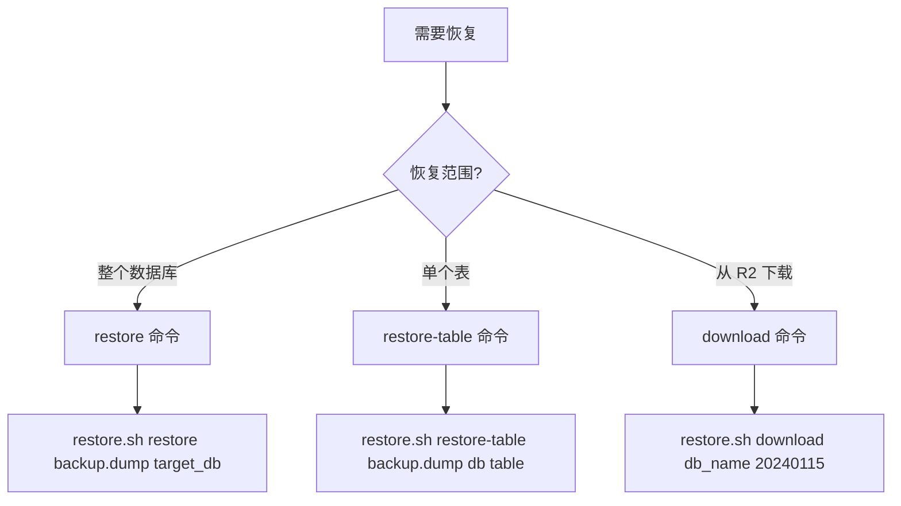

# PostgreSQL 数据库备份系统实现教程

本教程介绍如何为 GCE 生产环境配置自动化数据库备份系统，包括本地备份、云存储同步和健康监控。

## 目录

- [架构概览](#架构概览)
- [前置条件](#前置条件)
- [实现步骤](#实现步骤)
  - [1. 创建目录结构](#1-创建目录结构)
  - [2. 创建备份脚本](#2-创建备份脚本)
  - [3. 配置 rclone 连接 R2](#3-配置-rclone-连接-r2)
  - [4. 配置 PostgreSQL 认证](#4-配置-postgresql-认证)
  - [5. 设置 Cron 定时任务](#5-设置-cron-定时任务)
- [使用指南](#使用指南)
- [故障排除](#故障排除)

## 架构概览



### 备份策略

| 类型 | 频率 | 保留期 | 存储位置 |
|------|------|--------|----------|
| 逻辑备份 (pg_dump) | 每日 00:00 | 30 天 | 本地 + R2 |
| 物理备份 (pg_basebackup) | 每周日 02:00 | 4 周 | 本地 + R2 |
| 健康检查 | 每 6 小时 | - | 日志 |

## 前置条件

- Ubuntu/Debian 系统
- PostgreSQL 已安装并运行
- 具有 sudo 权限
- Cloudflare R2 账户（或其他 S3 兼容存储）

## 实现步骤

### 1. 创建目录结构

```bash
# 创建备份目录
sudo mkdir -p /backup/{postgres/{daily,weekly,wal-archive},scripts,logs}

# 设置权限（替换 your_user 为实际用户名）
sudo chown -R $USER:$USER /backup

# 验证结构
tree /backup
```

预期输出：

```
/backup
├── logs
├── postgres
│   ├── daily
│   ├── wal-archive
│   └── weekly
└── scripts
```

### 2. 创建备份脚本

#### 2.1 每日逻辑备份脚本

创建 `/backup/scripts/backup-daily.sh`：

```bash
#!/bin/bash
#
# Daily PostgreSQL Backup Script
# Performs logical backups of all production databases
#

set -euo pipefail

# =============================================================================
# Configuration - 根据实际环境修改
# =============================================================================

BACKUP_DIR="/backup/postgres/daily"
LOG_FILE="/backup/logs/backup-daily.log"
RETENTION_DAYS=30
TIMESTAMP=$(date +%Y%m%d_%H%M%S)

# Database connection
DB_HOST="localhost"
DB_USER="cs"                    # 修改为实际用户
DB_PORT="5432"

# Databases to backup
DATABASES=("medusa_production" "strapi_production")  # 修改为实际数据库

# R2 remote (configured in rclone)
R2_REMOTE="r2:cs-backups/postgres/daily"
R2_ENABLED=true

# =============================================================================
# Functions
# =============================================================================

log() {
    echo "[$(date '+%Y-%m-%d %H:%M:%S')] $1" | tee -a "$LOG_FILE"
}

log_error() {
    echo "[$(date '+%Y-%m-%d %H:%M:%S')] ERROR: $1" | tee -a "$LOG_FILE" >&2
}

send_alert() {
    local message=$1
    # Discord webhook (configure DISCORD_WEBHOOK_URL in environment)
    if [[ -n "${DISCORD_WEBHOOK_URL:-}" ]]; then
        curl -s -X POST "$DISCORD_WEBHOOK_URL" \
            -H "Content-Type: application/json" \
            -d "{\"content\": \"🚨 **Backup Alert**: ${message}\"}" \
            > /dev/null 2>&1 || true
    fi
    log_error "$message"
}

backup_database() {
    local db=$1
    local backup_file="${BACKUP_DIR}/${db}_${TIMESTAMP}.dump"

    log "Starting backup of ${db}..."

    # Use custom format for parallel restore support
    if pg_dump \
        -U "$DB_USER" \
        -h "$DB_HOST" \
        -p "$DB_PORT" \
        -d "$db" \
        --format=custom \
        --compress=6 \
        --file="$backup_file" \
        2>> "$LOG_FILE"; then

        # Verify backup integrity
        if pg_restore --list "$backup_file" > /dev/null 2>&1; then
            local size=$(du -h "$backup_file" | cut -f1)
            log "✓ ${db} backup successful: ${backup_file} (${size})"

            # Generate checksum
            sha256sum "$backup_file" > "${backup_file}.sha256"
            return 0
        else
            log_error "${db} backup verification failed!"
            rm -f "$backup_file"
            return 1
        fi
    else
        log_error "${db} pg_dump failed!"
        return 1
    fi
}

sync_to_r2() {
    if [[ "$R2_ENABLED" != "true" ]]; then
        log "R2 sync disabled, skipping..."
        return 0
    fi

    if ! command -v rclone &> /dev/null; then
        log "rclone not installed, skipping R2 sync..."
        return 0
    fi

    log "Syncing to R2..."
    if rclone sync "$BACKUP_DIR" "$R2_REMOTE" \
        --transfers=4 \
        --checkers=8 \
        --log-file="$LOG_FILE" \
        --log-level=INFO \
        2>> "$LOG_FILE"; then
        log "✓ R2 sync completed"
    else
        log_error "R2 sync failed"
        return 1
    fi
}

cleanup_old_backups() {
    log "Cleaning up backups older than ${RETENTION_DAYS} days..."

    local count=$(find "$BACKUP_DIR" -name "*.dump" -mtime +${RETENTION_DAYS} | wc -l)

    if [[ $count -gt 0 ]]; then
        find "$BACKUP_DIR" -name "*.dump" -mtime +${RETENTION_DAYS} -delete
        find "$BACKUP_DIR" -name "*.sha256" -mtime +${RETENTION_DAYS} -delete
        log "✓ Cleaned up ${count} old backup(s)"
    else
        log "No old backups to clean up"
    fi
}

# =============================================================================
# Main
# =============================================================================

main() {
    log "=========================================="
    log "Daily Backup Started"
    log "=========================================="

    mkdir -p "$BACKUP_DIR"

    local failed=0

    for db in "${DATABASES[@]}"; do
        if ! backup_database "$db"; then
            send_alert "Failed to backup ${db}"
            failed=1
        fi
    done

    if ! sync_to_r2; then
        send_alert "Failed to sync backups to R2"
        failed=1
    fi

    cleanup_old_backups

    log "=========================================="
    if [[ $failed -eq 0 ]]; then
        log "Daily Backup Completed Successfully"
    else
        log "Daily Backup Completed with Errors"
    fi
    log "=========================================="

    return $failed
}

main "$@"
```

#### 2.2 每周物理备份脚本

创建 `/backup/scripts/backup-weekly.sh`：

```bash
#!/bin/bash
#
# Weekly PostgreSQL Physical Backup Script
#

set -euo pipefail

BACKUP_DIR="/backup/postgres/weekly"
LOG_FILE="/backup/logs/backup-weekly.log"
RETENTION_WEEKS=4
TIMESTAMP=$(date +%Y%m%d_%H%M%S)

DB_HOST="localhost"
DB_USER="cs"
DB_PORT="5432"

R2_REMOTE="r2:cs-backups/postgres/weekly"
R2_ENABLED=true

log() {
    echo "[$(date '+%Y-%m-%d %H:%M:%S')] $1" | tee -a "$LOG_FILE"
}

log_error() {
    echo "[$(date '+%Y-%m-%d %H:%M:%S')] ERROR: $1" | tee -a "$LOG_FILE" >&2
}

perform_basebackup() {
    local backup_path="${BACKUP_DIR}/base_${TIMESTAMP}"
    local backup_archive="${backup_path}.tar.gz"

    log "Starting physical backup..."
    mkdir -p "$backup_path"

    if pg_basebackup \
        -U "$DB_USER" \
        -h "$DB_HOST" \
        -p "$DB_PORT" \
        -D "$backup_path" \
        -Ft -z -Xs -P \
        2>> "$LOG_FILE"; then

        log "Creating archive..."
        cd "$BACKUP_DIR"
        tar -czf "$backup_archive" -C "$BACKUP_DIR" "base_${TIMESTAMP}"
        rm -rf "$backup_path"

        local size=$(du -h "$backup_archive" | cut -f1)
        log "✓ Physical backup successful: ${backup_archive} (${size})"
        sha256sum "$backup_archive" > "${backup_archive}.sha256"
        return 0
    else
        log_error "pg_basebackup failed!"
        rm -rf "$backup_path"
        return 1
    fi
}

sync_to_r2() {
    if [[ "$R2_ENABLED" != "true" ]] || ! command -v rclone &> /dev/null; then
        return 0
    fi

    log "Syncing to R2..."
    local latest=$(ls -t "${BACKUP_DIR}"/base_*.tar.gz 2>/dev/null | head -1)

    if [[ -n "$latest" ]]; then
        rclone copy "$latest" "$R2_REMOTE" --log-file="$LOG_FILE" 2>> "$LOG_FILE"
        rclone copy "${latest}.sha256" "$R2_REMOTE" 2>> "$LOG_FILE" || true
        log "✓ R2 sync completed"
    fi
}

cleanup_old_backups() {
    local retention_days=$((RETENTION_WEEKS * 7))
    log "Cleaning up backups older than ${RETENTION_WEEKS} weeks..."
    find "$BACKUP_DIR" -name "base_*.tar.gz" -mtime +${retention_days} -delete
    find "$BACKUP_DIR" -name "base_*.tar.gz.sha256" -mtime +${retention_days} -delete
}

main() {
    log "=========================================="
    log "Weekly Physical Backup Started"
    log "=========================================="

    mkdir -p "$BACKUP_DIR"
    perform_basebackup
    sync_to_r2
    cleanup_old_backups

    log "=========================================="
    log "Weekly Backup Completed"
    log "=========================================="
}

main "$@"
```

#### 2.3 恢复脚本

创建 `/backup/scripts/restore.sh`：

```bash
#!/bin/bash
#
# PostgreSQL Restore Script
#

set -euo pipefail

BACKUP_DIR="/backup/postgres/daily"
LOG_FILE="/backup/logs/restore.log"
DB_HOST="localhost"
DB_USER="cs"
DB_PORT="5432"

log() {
    echo "[$(date '+%Y-%m-%d %H:%M:%S')] $1" | tee -a "$LOG_FILE"
}

usage() {
    cat << EOF
PostgreSQL Restore Script

Usage:
    $0 <command> [options]

Commands:
    list [database]               List available backups
    verify <backup_file>          Verify backup integrity
    restore <backup> <target_db>  Restore backup to target database
    restore-table <backup> <target_db> <table>  Restore single table
    download <database> <date>    Download backup from R2

Examples:
    $0 list
    $0 list medusa_production
    $0 verify /backup/postgres/daily/medusa_production_20240115.dump
    $0 restore /backup/postgres/daily/medusa_production_20240115.dump medusa_restore
    $0 restore-table /backup/postgres/daily/medusa_production_20240115.dump medusa_production product

EOF
    exit 1
}

list_backups() {
    local filter=${1:-}
    echo "Available backups in ${BACKUP_DIR}:"
    echo "=============================================="

    if [[ -n "$filter" ]]; then
        ls -lh "${BACKUP_DIR}/${filter}"_*.dump 2>/dev/null | awk '{print $9, $5, $6, $7, $8}' | sort -r | head -20
    else
        ls -lh "${BACKUP_DIR}"/*.dump 2>/dev/null | awk '{print $9, $5, $6, $7, $8}' | sort -r | head -20
    fi

    echo ""
    echo "Total backups: $(ls -1 "${BACKUP_DIR}"/*.dump 2>/dev/null | wc -l)"
}

verify_backup() {
    local backup_file=$1

    [[ ! -f "$backup_file" ]] && { log "Backup file not found: $backup_file"; return 1; }

    log "Verifying backup: $backup_file"

    if ! pg_restore --list "$backup_file" > /dev/null 2>&1; then
        log "ERROR: Backup file is corrupted"
        return 1
    fi

    if [[ -f "${backup_file}.sha256" ]]; then
        if sha256sum -c "${backup_file}.sha256" > /dev/null 2>&1; then
            log "✓ Checksum verified"
        else
            log "ERROR: Checksum mismatch!"
            return 1
        fi
    fi

    log "✓ Backup verified successfully"
}

restore_database() {
    local backup_file=$1
    local target_db=$2

    [[ ! -f "$backup_file" ]] && { log "Backup file not found"; return 1; }

    log "Restoring to database: $target_db"

    # Check if target exists
    if psql -U "$DB_USER" -h "$DB_HOST" -lqt | cut -d \| -f 1 | grep -qw "$target_db"; then
        read -p "Database exists. Drop and recreate? (y/N): " confirm
        [[ "$confirm" != "y" ]] && return 1
        dropdb -U "$DB_USER" -h "$DB_HOST" "$target_db" || true
    fi

    createdb -U "$DB_USER" -h "$DB_HOST" "$target_db"

    if pg_restore -U "$DB_USER" -h "$DB_HOST" -d "$target_db" --jobs=4 "$backup_file" 2>> "$LOG_FILE"; then
        log "✓ Database restored successfully"
    else
        log "Restore completed with warnings (check log)"
    fi
}

restore_table() {
    local backup_file=$1
    local target_db=$2
    local table_name=$3

    log "Restoring table '$table_name' to $target_db"

    psql -U "$DB_USER" -h "$DB_HOST" -d "$target_db" \
        -c "DROP TABLE IF EXISTS \"$table_name\" CASCADE;" 2>/dev/null || true

    pg_restore -U "$DB_USER" -h "$DB_HOST" -d "$target_db" \
        --table="$table_name" "$backup_file" 2>> "$LOG_FILE"

    local count=$(psql -U "$DB_USER" -h "$DB_HOST" -d "$target_db" \
        -t -c "SELECT COUNT(*) FROM \"$table_name\";" 2>/dev/null | tr -d ' ')

    log "✓ Table '$table_name' restored (${count} rows)"
}

download_from_r2() {
    local database=$1
    local date=$2

    log "Downloading ${database}_${date}* from R2..."
    rclone copy "r2:cs-backups/postgres/daily/${database}_${date}"* "$BACKUP_DIR" --progress
    log "✓ Download completed"
}

# Main
[[ $# -lt 1 ]] && usage

case "$1" in
    list)         list_backups "${2:-}" ;;
    verify)       [[ $# -lt 2 ]] && usage; verify_backup "$2" ;;
    restore)      [[ $# -lt 3 ]] && usage; restore_database "$2" "$3" ;;
    restore-table) [[ $# -lt 4 ]] && usage; restore_table "$2" "$3" "$4" ;;
    download)     [[ $# -lt 3 ]] && usage; download_from_r2 "$2" "$3" ;;
    *)            usage ;;
esac
```

#### 2.4 健康检查脚本

创建 `/backup/scripts/health-check.sh`：

```bash
#!/bin/bash
#
# Backup Health Check Script
#

set -euo pipefail

BACKUP_DIR="/backup/postgres/daily"
WEEKLY_DIR="/backup/postgres/weekly"
LOG_FILE="/backup/logs/health-check.log"

MAX_AGE_HOURS=25
MIN_SIZE_KB=100
DATABASES=("medusa_production" "strapi_production")

log() {
    echo "[$(date '+%Y-%m-%d %H:%M:%S')] $1" | tee -a "$LOG_FILE"
}

send_alert() {
    local message=$1
    local level=${2:-WARNING}

    if [[ -n "${DISCORD_WEBHOOK_URL:-}" ]]; then
        local emoji="⚠️"
        [[ "$level" == "CRITICAL" ]] && emoji="🚨"
        curl -s -X POST "$DISCORD_WEBHOOK_URL" \
            -H "Content-Type: application/json" \
            -d "{\"content\": \"${emoji} **Backup ${level}**: ${message}\"}" \
            > /dev/null 2>&1 || true
    fi
    log "${level}: ${message}"
}

check_backup() {
    local db=$1
    local latest=$(ls -t "${BACKUP_DIR}/${db}_"*.dump 2>/dev/null | head -1)

    if [[ -z "$latest" ]]; then
        send_alert "No backup found for ${db}" "CRITICAL"
        return 1
    fi

    # Check age
    local age_hours=$(( ($(date +%s) - $(stat -c %Y "$latest")) / 3600 ))
    if [[ $age_hours -gt $MAX_AGE_HOURS ]]; then
        send_alert "${db}: Backup is ${age_hours}h old" "CRITICAL"
        return 1
    fi

    # Check size
    local size_kb=$(($(stat -c %s "$latest") / 1024))
    if [[ $size_kb -lt $MIN_SIZE_KB ]]; then
        send_alert "${db}: Backup too small (${size_kb}KB)" "WARNING"
        return 1
    fi

    # Check integrity
    if ! pg_restore --list "$latest" > /dev/null 2>&1; then
        send_alert "${db}: Backup corrupted!" "CRITICAL"
        return 1
    fi

    log "OK: ${db} - ${age_hours}h ago, ${size_kb}KB"
    return 0
}

generate_report() {
    echo ""
    echo "=============================================="
    echo "Backup Health Report - $(date '+%Y-%m-%d %H:%M:%S')"
    echo "=============================================="
    echo ""
    echo "Daily Backups:"
    for db in "${DATABASES[@]}"; do
        local latest=$(ls -t "${BACKUP_DIR}/${db}_"*.dump 2>/dev/null | head -1)
        if [[ -n "$latest" ]]; then
            local size=$(du -h "$latest" | cut -f1)
            local age=$(( ($(date +%s) - $(stat -c %Y "$latest")) / 3600 ))
            echo "  ${db}: ${size}, ${age}h ago"
        else
            echo "  ${db}: NO BACKUP!"
        fi
    done
    echo ""
    echo "Disk Usage:"
    df -h /backup | tail -1 | awk '{print "  Used: "$3" / "$2" ("$5")"}'
    echo ""
}

main() {
    log "=========================================="
    log "Health Check Started"
    log "=========================================="

    local failed=0

    # Check disk space
    local usage=$(df /backup | tail -1 | awk '{print $5}' | tr -d '%')
    if [[ $usage -gt 90 ]]; then
        send_alert "Disk usage critical: ${usage}%" "CRITICAL"
        failed=1
    fi

    # Check each database
    for db in "${DATABASES[@]}"; do
        check_backup "$db" || failed=1
    done

    generate_report

    log "=========================================="
    [[ $failed -eq 0 ]] && log "Health Check: ALL OK" || log "Health Check: ISSUES DETECTED"
    log "=========================================="

    return $failed
}

main "$@"
```

#### 2.5 设置脚本权限

```bash
chmod +x /backup/scripts/*.sh
```

### 3. 配置 rclone 连接 R2

#### 3.1 安装 rclone

```bash
curl -s https://rclone.org/install.sh | sudo bash
```

#### 3.2 创建 rclone 配置

```bash
mkdir -p ~/.config/rclone

cat > ~/.config/rclone/rclone.conf << 'EOF'
[r2]
type = s3
provider = Cloudflare
access_key_id = YOUR_R2_ACCESS_KEY_ID
secret_access_key = YOUR_R2_SECRET_ACCESS_KEY
endpoint = https://YOUR_ACCOUNT_ID.r2.cloudflarestorage.com
acl = private
EOF

chmod 600 ~/.config/rclone/rclone.conf
```

**获取 R2 凭据：**
1. 登录 Cloudflare Dashboard
2. 进入 R2 → Overview → Manage R2 API Tokens
3. 创建 API Token，选择 "Object Read & Write" 权限

#### 3.3 验证连接并创建 bucket

```bash
# 测试连接
rclone lsd r2:

# 创建备份 bucket
rclone mkdir r2:cs-backups
```

### 4. 配置 PostgreSQL 认证

创建 `.pgpass` 文件实现免密码连接：

```bash
cat > ~/.pgpass << 'EOF'
localhost:5432:*:YOUR_DB_USER:YOUR_DB_PASSWORD
EOF

chmod 600 ~/.pgpass
```

**测试连接：**

```bash
psql -U cs -h localhost -d medusa_production -c "SELECT 1;"
```

### 5. 设置 Cron 定时任务

#### 5.1 创建 cron 配置文件

```bash
cat > /backup/scripts/postgres-backup.cron << 'EOF'
# PostgreSQL Backup Cron Jobs
SHELL=/bin/bash
PATH=/usr/local/sbin:/usr/local/bin:/sbin:/bin:/usr/sbin:/usr/bin
HOME=/home/coderisedev

# Daily logical backup - 00:00
0 0 * * * coderisedev /backup/scripts/backup-daily.sh >> /backup/logs/cron.log 2>&1

# Weekly physical backup - Sunday 02:00
0 2 * * 0 coderisedev /backup/scripts/backup-weekly.sh >> /backup/logs/cron.log 2>&1

# Health check - every 6 hours
0 */6 * * * coderisedev /backup/scripts/health-check.sh >> /backup/logs/cron.log 2>&1

# Log rotation - daily 03:00
0 3 * * * coderisedev find /backup/logs -name "*.log" -mtime +30 -delete
EOF
```

#### 5.2 安装 cron 任务

```bash
sudo cp /backup/scripts/postgres-backup.cron /etc/cron.d/postgres-backup
sudo chmod 644 /etc/cron.d/postgres-backup
```

#### 5.3 验证 cron 已加载

```bash
sudo systemctl restart cron
grep -r "backup" /etc/cron.d/
```

## 使用指南

### 手动执行备份

```bash
# 执行每日备份
/backup/scripts/backup-daily.sh

# 执行每周备份
/backup/scripts/backup-weekly.sh
```

### 查看备份

```bash
# 列出所有备份
/backup/scripts/restore.sh list

# 列出特定数据库的备份
/backup/scripts/restore.sh list medusa_production

# 查看 R2 上的备份
rclone ls r2:cs-backups/postgres/daily/
```

### 验证备份

```bash
/backup/scripts/restore.sh verify /backup/postgres/daily/medusa_production_20240115_000000.dump
```

### 恢复数据库



```bash
# 恢复到新数据库（推荐，不影响生产）
/backup/scripts/restore.sh restore \
    /backup/postgres/daily/medusa_production_20240115_000000.dump \
    medusa_restore

# 恢复单个表到现有数据库
/backup/scripts/restore.sh restore-table \
    /backup/postgres/daily/medusa_production_20240115_000000.dump \
    medusa_production \
    product

# 从 R2 下载备份
/backup/scripts/restore.sh download medusa_production 20240115
```

### 健康检查

```bash
# 手动运行健康检查
/backup/scripts/health-check.sh

# 查看日志
tail -f /backup/logs/health-check.log
```

### 配置告警（可选）

设置 Discord Webhook 接收告警：

```bash
# 添加到 /etc/environment 或 ~/.bashrc
export DISCORD_WEBHOOK_URL="https://discord.com/api/webhooks/xxx/yyy"
```

## 故障排除

### 备份失败：pg_dump 连接错误

```bash
# 检查 .pgpass 文件权限
ls -la ~/.pgpass  # 应该是 600

# 测试数据库连接
psql -U cs -h localhost -d medusa_production -c "SELECT 1;"

# 检查 PostgreSQL 日志
sudo tail -50 /var/log/postgresql/postgresql-*-main.log
```

### R2 同步失败

```bash
# 测试 rclone 配置
rclone lsd r2:

# 检查配置文件
cat ~/.config/rclone/rclone.conf

# 手动测试同步
rclone sync /backup/postgres/daily r2:cs-backups/postgres/daily --dry-run
```

### Cron 任务未执行

```bash
# 检查 cron 服务
sudo systemctl status cron

# 查看 cron 日志
grep CRON /var/log/syslog | tail -20

# 检查 cron 文件语法
cat /etc/cron.d/postgres-backup
```

### 磁盘空间不足

```bash
# 检查磁盘使用
df -h /backup

# 手动清理旧备份
find /backup/postgres/daily -name "*.dump" -mtime +7 -delete

# 调整保留策略（修改脚本中的 RETENTION_DAYS）
```

## 文件清单

```
/backup/
├── postgres/
│   ├── daily/              # 每日逻辑备份
│   │   ├── medusa_production_YYYYMMDD_HHMMSS.dump
│   │   └── strapi_production_YYYYMMDD_HHMMSS.dump
│   ├── weekly/             # 每周物理备份
│   │   └── base_YYYYMMDD_HHMMSS.tar.gz
│   └── wal-archive/        # WAL 归档（如启用）
├── scripts/
│   ├── backup-daily.sh     # 每日备份脚本
│   ├── backup-weekly.sh    # 每周备份脚本
│   ├── restore.sh          # 恢复工具
│   ├── health-check.sh     # 健康检查
│   └── postgres-backup.cron # Cron 配置
└── logs/
    ├── backup-daily.log
    ├── backup-weekly.log
    ├── health-check.log
    └── cron.log

~/.config/rclone/rclone.conf  # R2 配置
~/.pgpass                      # PostgreSQL 认证
/etc/cron.d/postgres-backup    # 系统 Cron 任务
```

## 快速参考卡

| 操作 | 命令 |
|------|------|
| 手动备份 | `/backup/scripts/backup-daily.sh` |
| 列出备份 | `/backup/scripts/restore.sh list` |
| 验证备份 | `/backup/scripts/restore.sh verify <file>` |
| 恢复数据库 | `/backup/scripts/restore.sh restore <file> <db>` |
| 恢复单表 | `/backup/scripts/restore.sh restore-table <file> <db> <table>` |
| 健康检查 | `/backup/scripts/health-check.sh` |
| 查看 R2 | `rclone ls r2:cs-backups/postgres/daily/` |
| 查看日志 | `tail -f /backup/logs/backup-daily.log` |
