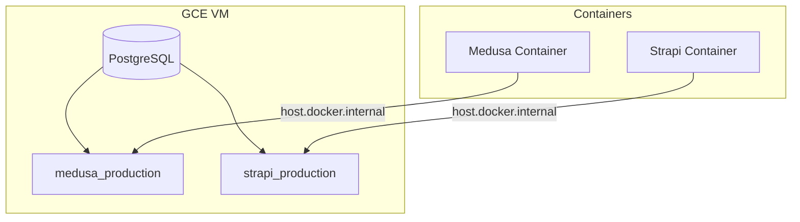
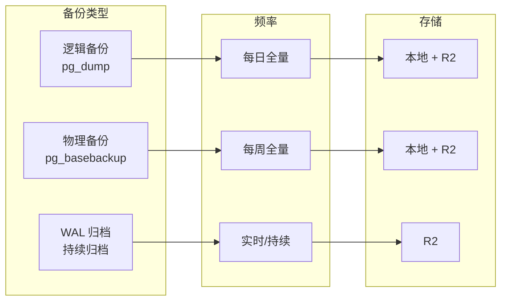
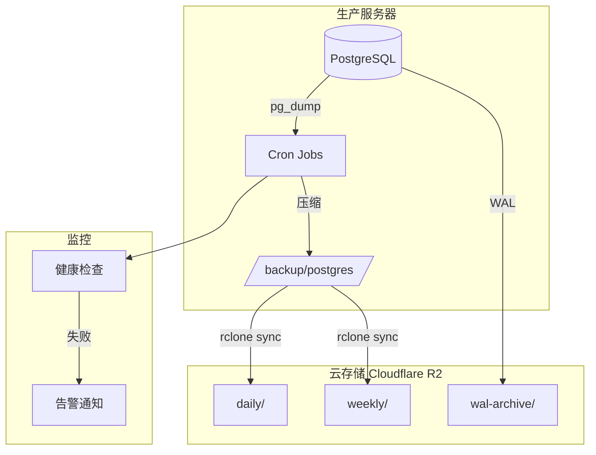
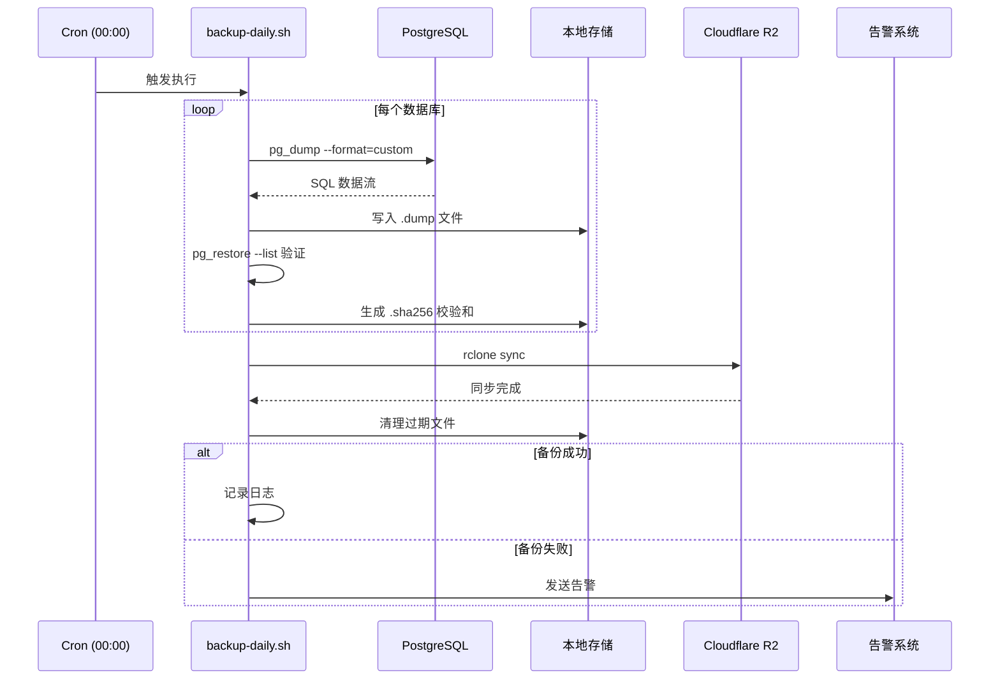
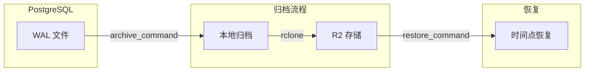
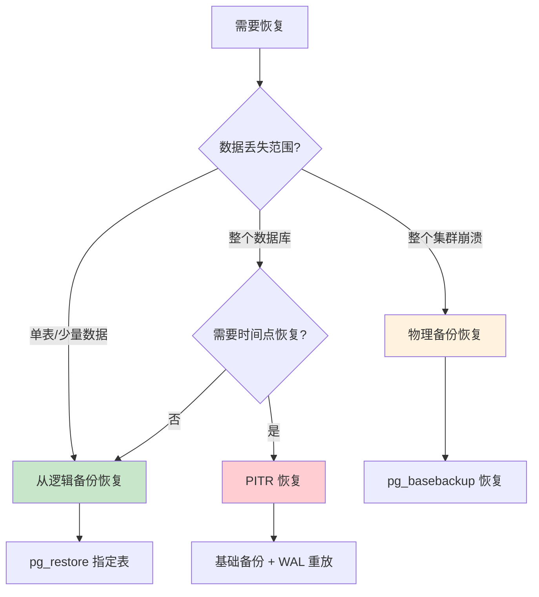
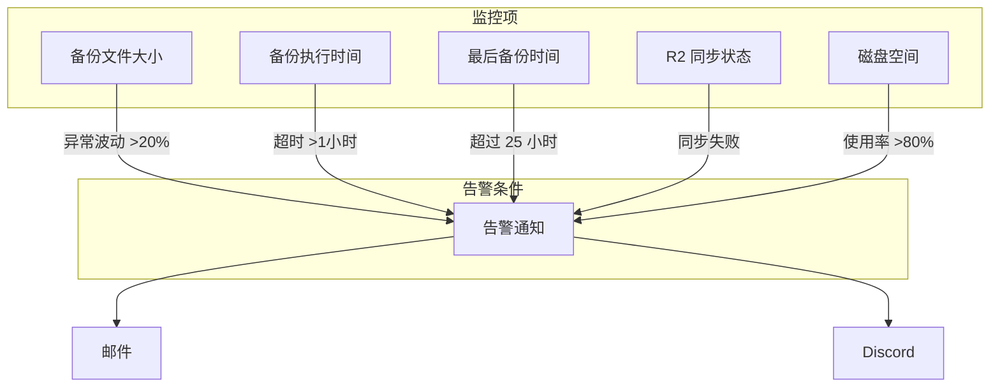
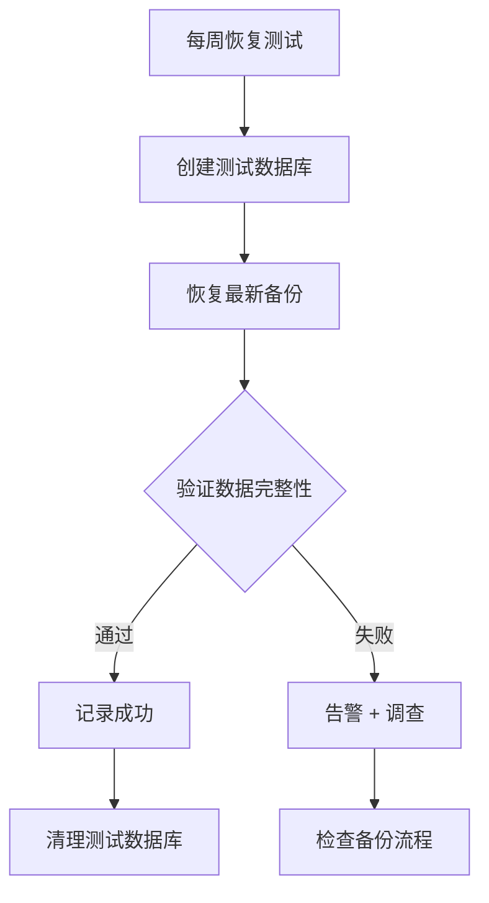

# 生产环境数据库备份策略

## 当前环境



## 备份策略概览



| 备份类型 | 方式 | 频率 | 保留期 | 恢复时间 |
|---------|------|------|--------|---------|
| 逻辑备份 | pg_dump | 每日 00:00 | 30天 | 中等 |
| 物理备份 | pg_basebackup | 每周日 02:00 | 4周 | 快速 |
| WAL 归档 | archive_command | 持续 | 7天 | 最快（PITR） |

## 推荐架构



## 实施方案

### 1. 目录结构

```bash
/backup/
├── postgres/
│   ├── daily/           # 每日逻辑备份
│   ├── weekly/          # 每周物理备份
│   └── wal-archive/     # WAL 归档（如启用）
├── scripts/
│   ├── backup-daily.sh
│   ├── backup-weekly.sh
│   ├── restore.sh
│   └── cleanup.sh
└── logs/
    └── backup.log
```

```bash
# 创建目录
sudo mkdir -p /backup/{postgres/{daily,weekly,wal-archive},scripts,logs}
sudo chown -R postgres:postgres /backup/postgres
```

### 2. 每日逻辑备份脚本

```bash
#!/bin/bash
# /backup/scripts/backup-daily.sh

set -euo pipefail

# 配置
BACKUP_DIR="/backup/postgres/daily"
LOG_FILE="/backup/logs/backup.log"
RETENTION_DAYS=30
TIMESTAMP=$(date +%Y%m%d_%H%M%S)

# 数据库列表
DATABASES=("medusa_production" "strapi_production")

# R2 配置（通过 rclone）
R2_REMOTE="r2:cs-backups/postgres/daily"

log() {
    echo "[$(date '+%Y-%m-%d %H:%M:%S')] $1" | tee -a "$LOG_FILE"
}

backup_database() {
    local db=$1
    local backup_file="${BACKUP_DIR}/${db}_${TIMESTAMP}.sql.gz"

    log "开始备份 ${db}..."

    # 使用 custom format 支持并行恢复，然后压缩
    pg_dump -U cs -h localhost -d "$db" \
        --format=custom \
        --compress=9 \
        --file="${backup_file%.gz}" \
        2>> "$LOG_FILE"

    # 验证备份文件
    if pg_restore --list "${backup_file%.gz}" > /dev/null 2>&1; then
        log "✓ ${db} 备份成功: ${backup_file%.gz}"

        # 计算校验和
        sha256sum "${backup_file%.gz}" > "${backup_file%.gz}.sha256"
    else
        log "✗ ${db} 备份验证失败!"
        return 1
    fi
}

sync_to_r2() {
    log "同步到 R2..."
    rclone sync "$BACKUP_DIR" "$R2_REMOTE" \
        --transfers=4 \
        --checkers=8 \
        --log-file="$LOG_FILE" \
        --log-level=INFO
    log "✓ R2 同步完成"
}

cleanup_old_backups() {
    log "清理 ${RETENTION_DAYS} 天前的备份..."
    find "$BACKUP_DIR" -name "*.sql*" -mtime +${RETENTION_DAYS} -delete
    log "✓ 本地清理完成"
}

# 主流程
main() {
    log "========== 每日备份开始 =========="

    for db in "${DATABASES[@]}"; do
        backup_database "$db" || {
            log "备份失败，发送告警"
            # 可接入告警系统
            exit 1
        }
    done

    sync_to_r2
    cleanup_old_backups

    log "========== 每日备份完成 =========="
}

main
```

### 3. 备份流程图



### 4. 每周物理备份脚本

```bash
#!/bin/bash
# /backup/scripts/backup-weekly.sh

set -euo pipefail

BACKUP_DIR="/backup/postgres/weekly"
TIMESTAMP=$(date +%Y%m%d_%H%M%S)
BACKUP_PATH="${BACKUP_DIR}/base_${TIMESTAMP}"

log() {
    echo "[$(date '+%Y-%m-%d %H:%M:%S')] $1"
}

log "开始物理备份..."

# 物理备份整个集群
pg_basebackup \
    -U cs \
    -h localhost \
    -D "$BACKUP_PATH" \
    -Ft \
    -z \
    -Xs \
    -P

log "压缩备份..."
tar -czf "${BACKUP_PATH}.tar.gz" -C "$BACKUP_DIR" "base_${TIMESTAMP}"
rm -rf "$BACKUP_PATH"

log "同步到 R2..."
rclone copy "${BACKUP_PATH}.tar.gz" "r2:cs-backups/postgres/weekly/"

log "清理 4 周前的备份..."
find "$BACKUP_DIR" -name "base_*.tar.gz" -mtime +28 -delete

log "✓ 物理备份完成"
```

### 5. Cron 配置

```bash
# /etc/cron.d/postgres-backup

# 每日逻辑备份 - 凌晨 0 点
0 0 * * * root /backup/scripts/backup-daily.sh >> /backup/logs/cron.log 2>&1

# 每周物理备份 - 周日凌晨 2 点
0 2 * * 0 root /backup/scripts/backup-weekly.sh >> /backup/logs/cron.log 2>&1

# 每日清理日志 - 保留 30 天
0 3 * * * root find /backup/logs -name "*.log" -mtime +30 -delete
```

## WAL 归档配置（可选，用于 PITR）



### postgresql.conf 配置

```ini
# WAL 归档配置
wal_level = replica
archive_mode = on
archive_command = '/backup/scripts/archive-wal.sh %p %f'
archive_timeout = 300  # 5分钟强制归档

# 保留足够的 WAL 用于恢复
wal_keep_size = 1GB
```

### WAL 归档脚本

```bash
#!/bin/bash
# /backup/scripts/archive-wal.sh

WAL_PATH=$1
WAL_FILE=$2
ARCHIVE_DIR="/backup/postgres/wal-archive"
R2_WAL="r2:cs-backups/postgres/wal-archive"

# 复制到本地归档
cp "$WAL_PATH" "${ARCHIVE_DIR}/${WAL_FILE}"

# 异步同步到 R2
rclone copy "${ARCHIVE_DIR}/${WAL_FILE}" "$R2_WAL" &

exit 0
```

## 恢复流程

### 恢复决策树



### 恢复脚本

```bash
#!/bin/bash
# /backup/scripts/restore.sh

set -euo pipefail

usage() {
    echo "用法: $0 <backup_file> <target_database> [--table=table_name]"
    echo ""
    echo "示例:"
    echo "  $0 medusa_production_20240115.dump medusa_restore"
    echo "  $0 medusa_production_20240115.dump medusa_production --table=product"
    exit 1
}

BACKUP_FILE=$1
TARGET_DB=$2
TABLE_OPTION=${3:-}

if [[ ! -f "$BACKUP_FILE" ]]; then
    echo "错误: 备份文件不存在"
    exit 1
fi

echo "验证备份文件..."
pg_restore --list "$BACKUP_FILE" > /dev/null || {
    echo "错误: 备份文件损坏"
    exit 1
}

if [[ -n "$TABLE_OPTION" ]]; then
    # 恢复单表
    TABLE_NAME=${TABLE_OPTION#--table=}
    echo "恢复单表: $TABLE_NAME 到 $TARGET_DB"

    pg_restore \
        -U cs \
        -h localhost \
        -d "$TARGET_DB" \
        --table="$TABLE_NAME" \
        --clean \
        --if-exists \
        "$BACKUP_FILE"
else
    # 恢复整个数据库
    echo "恢复整个数据库到: $TARGET_DB"

    # 先创建数据库（如果不存在）
    createdb -U cs -h localhost "$TARGET_DB" 2>/dev/null || true

    pg_restore \
        -U cs \
        -h localhost \
        -d "$TARGET_DB" \
        --clean \
        --if-exists \
        --jobs=4 \
        "$BACKUP_FILE"
fi

echo "✓ 恢复完成"
```

## 监控与告警



### 健康检查脚本

```bash
#!/bin/bash
# /backup/scripts/health-check.sh

BACKUP_DIR="/backup/postgres/daily"
MAX_AGE_HOURS=25
MIN_SIZE_MB=1

check_latest_backup() {
    local db=$1
    local latest=$(ls -t "${BACKUP_DIR}/${db}_"*.dump 2>/dev/null | head -1)

    if [[ -z "$latest" ]]; then
        echo "CRITICAL: ${db} 没有找到备份文件"
        return 1
    fi

    # 检查年龄
    local age_hours=$(( ($(date +%s) - $(stat -c %Y "$latest")) / 3600 ))
    if [[ $age_hours -gt $MAX_AGE_HOURS ]]; then
        echo "WARNING: ${db} 最后备份已超过 ${age_hours} 小时"
        return 1
    fi

    # 检查大小
    local size_mb=$(( $(stat -c %s "$latest") / 1024 / 1024 ))
    if [[ $size_mb -lt $MIN_SIZE_MB ]]; then
        echo "WARNING: ${db} 备份文件过小 (${size_mb}MB)"
        return 1
    fi

    echo "OK: ${db} - ${age_hours}h ago, ${size_mb}MB"
    return 0
}

# 检查所有数据库
FAILED=0
for db in medusa_production strapi_production; do
    check_latest_backup "$db" || FAILED=1
done

exit $FAILED
```

### Cron 健康检查

```bash
# 每小时检查备份状态
0 * * * * root /backup/scripts/health-check.sh || curl -X POST "https://discord.webhook.url" -d '{"content":"⚠️ 数据库备份异常"}'
```

## 备份验证策略



### 自动验证脚本

```bash
#!/bin/bash
# /backup/scripts/verify-backup.sh

TEST_DB="medusa_verify_$(date +%Y%m%d)"
LATEST_BACKUP=$(ls -t /backup/postgres/daily/medusa_production_*.dump | head -1)

echo "创建测试数据库..."
createdb -U cs "$TEST_DB"

echo "恢复备份..."
pg_restore -U cs -d "$TEST_DB" --jobs=4 "$LATEST_BACKUP"

echo "验证关键表..."
PRODUCT_COUNT=$(psql -U cs -d "$TEST_DB" -t -c "SELECT COUNT(*) FROM product;")
ORDER_COUNT=$(psql -U cs -d "$TEST_DB" -t -c "SELECT COUNT(*) FROM order;")

echo "产品数: $PRODUCT_COUNT"
echo "订单数: $ORDER_COUNT"

echo "清理测试数据库..."
dropdb -U cs "$TEST_DB"

echo "✓ 备份验证完成"
```

## 总结：备份策略矩阵


| 场景 | 推荐方案 | RPO | RTO |
|------|---------|-----|-----|
| 小型项目 | 每日 pg_dump | 24小时 | 1-2小时 |
| 中型项目 | 每日 pg_dump + 每周物理 | 24小时 | 30分钟 |
| 大型/关键项目 | WAL 归档 + PITR | 分钟级 | 15分钟 |

**当前推荐：每日 pg_dump + R2 同步 + 每周物理备份**

这个方案平衡了复杂度和可靠性，适合当前规模的生产环境。
