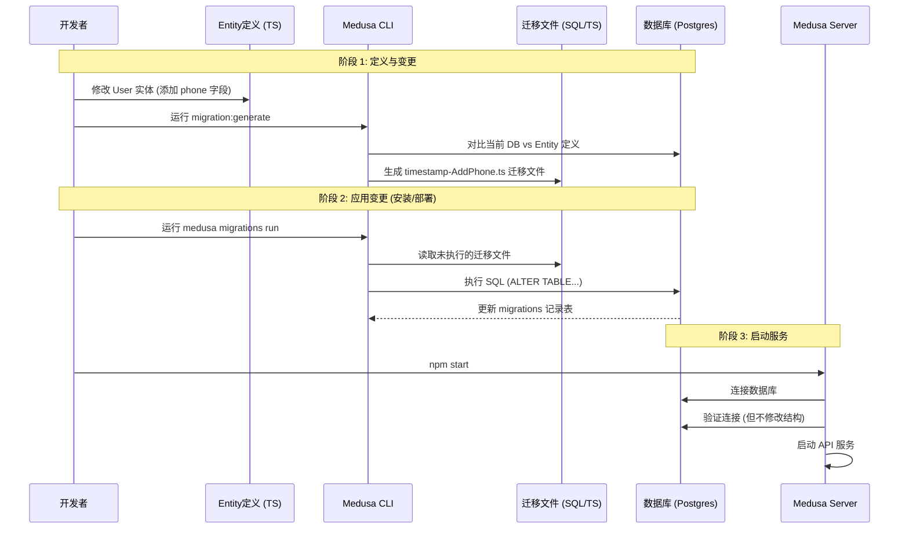

# Medusa 数据库管理逻辑与迁移机制解析

**最后更新**: 2026-01-13
**分类**: 架构原理 / Medusa

Medusa 与 Strapi 在数据库管理上有本质区别。Strapi 采用的是“运行时自动同步（Auto-Sync）”，而 Medusa 采用的是更为严谨的 **“迁移脚本驱动（Migration-Driven）”** 模式。

---

## 1. 核心差异对比

| 特性 | Strapi (Schema-First) | Medusa (Code-First / Migration-Driven) |
| :--- | :--- | :--- |
| **表结构来源** | `schema.json` 配置文件 | TypeScript 实体类 (`.entity.ts`) + 迁移脚本 |
| **变更方式** | 修改 JSON -> **重启** -> 自动 `ALTER TABLE` | 修改 Entity -> **生成 Migration** -> **运行 Migration** |
| **安全性** | 方便但有隐患（易误删列） | 严谨，变更历史可追溯，生产环境更安全 |
| **启动要求** | 启动时自动检查并建表 | **启动前必须手动完成建表（Migration）** |

---

## 2. Medusa 数据库生命周期

Medusa 的数据库管理严格遵循 **Entities（实体）** 和 **Migrations（迁移）** 分离的原则。



---

## 3. 为什么安装环节必须连接数据库？

在执行 `npx create-medusa-app` 或手动初始化时，Medusa 必须完成 **Seeding（播种）** 和 **Migrating（迁移）**。

### 执行逻辑：
1.  **连接检查**：确保能与 PostgreSQL 建立通信。
2.  **运行核心迁移 (`migrations run`)**：Medusa 核心包内置了基础迁移脚本，创建 `product`, `order`, `customer`, `region` 等核心表。
3.  **运行插件迁移**：如果配置了支付或通知插件，插件会创建其专属的扩展表。
4.  **数据播种 (`seed`)**：表结构建好后，脚本会插入初始管理员账号、默认店铺设置和货币设置。

**结论**：如果不连库或连库失败，安装程序无法完成“建表”这一步，Medusa 服务将因找不到基础表结构而无法启动。

---

## 4. 生产环境最佳实践

在生产环境（如 Docker 或 PM2 部署）中，典型的启动流程如下：

```bash
# 典型的部署启动指令
medusa migrations run && medusa start
```

这体现了 Medusa 的设计哲学：**“先升级结构，再启动服务”**。
*   **版本控制**：所有的数据库变更都记录在代码仓库的 `migrations` 文件夹中，任何开发者拉取代码后运行 `migrations run` 都能得到完全一致的数据库结构。
*   **防止意外**：不会因为一次代码重启就自动修改数据库，所有的破坏性变更（如删除字段）都需要开发者显式地生成并审阅迁移脚本。

---

## 总结

*   **Medusa 是“先建房，后入住”**：必须先通过 Migration 工具把数据库表结构盖好，应用程序才能运行。
*   **Strapi 是“边住边改”**：应用程序启动时检查房子结构，发现不对劲就自动拆墙砌墙。

这种差异使得 Medusa 在复杂的电商场景（涉及大量财务数据、订单状态机）下更加稳定和可控。
