# Medusa 数据库迁移机制

## 概述

Medusa 2.x 使用 **MikroORM** 作为 ORM，采用 **显式迁移文件** 机制（与 Strapi 的自动同步完全不同）。

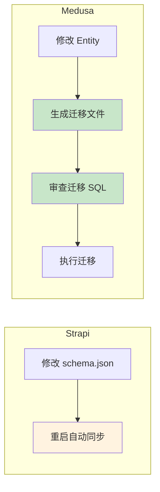

**关键区别：Medusa 需要显式生成和执行迁移，提供更多控制和安全性。**

## Medusa CLI 迁移命令

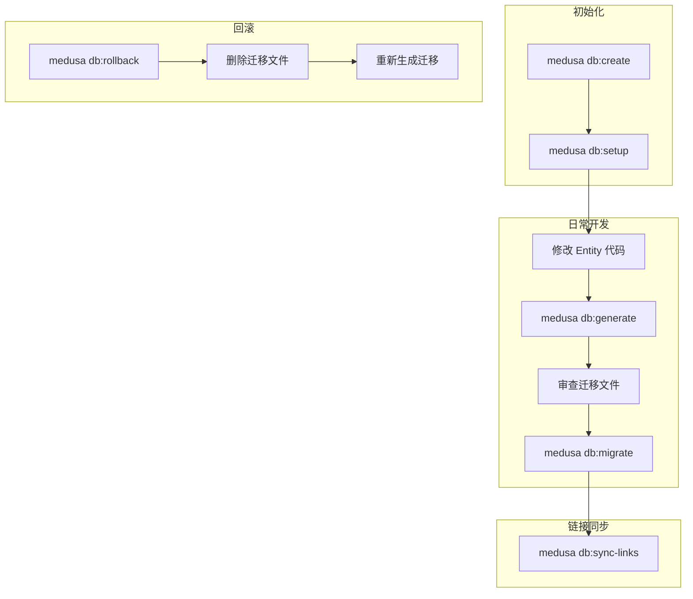

| 命令 | 作用 | 使用场景 |
|------|------|---------|
| `medusa db:create` | 创建数据库 | 首次设置 |
| `medusa db:setup` | 创建库 + 迁移 + 同步链接 | 首次设置（一键完成） |
| `medusa db:generate [module]` | 生成迁移文件 | 修改模型后 |
| `medusa db:migrate` | 执行待处理迁移 | 部署时 |
| `medusa db:rollback [module]` | 回滚上批迁移 | 撤销错误迁移 |
| `medusa db:sync-links` | 同步模块间链接关系 | 添加新关联后 |

## 完整迁移流程

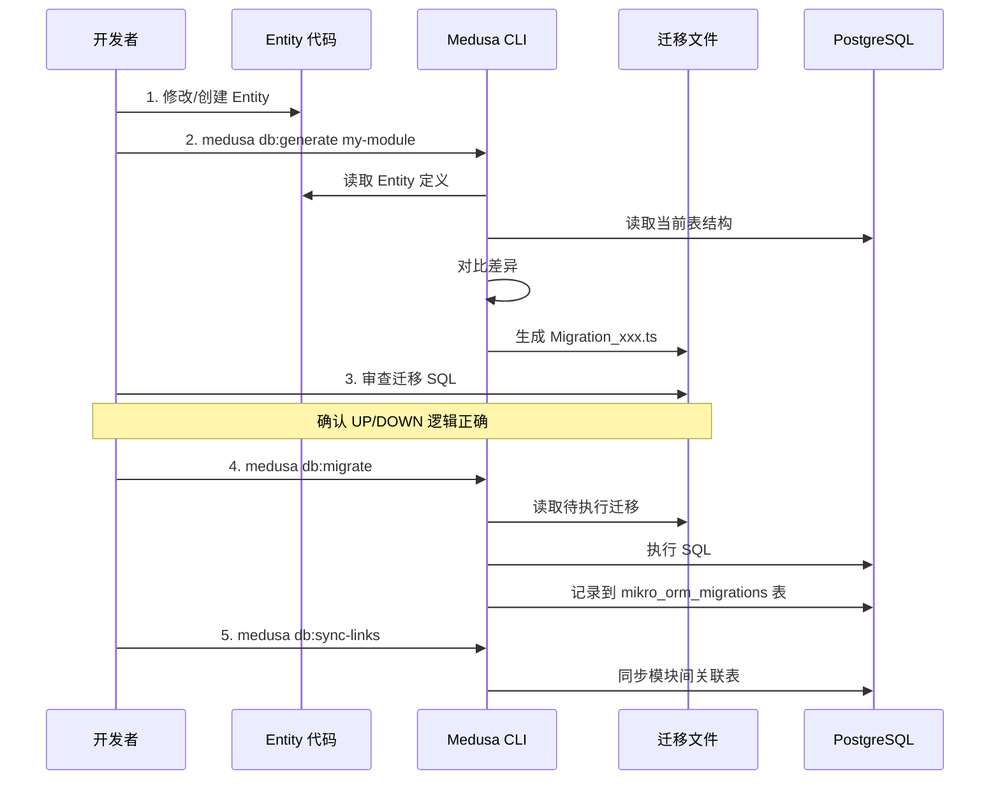

## Medusa 模块架构

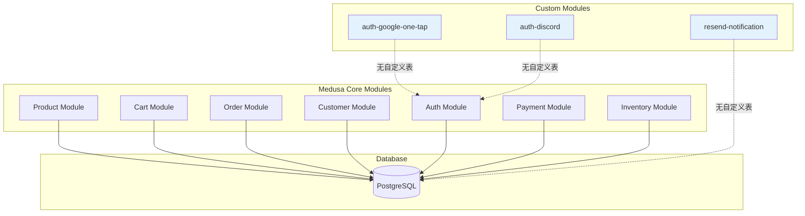

**当前项目的自定义模块没有创建自定义数据表，而是扩展核心模块的功能。**

## 创建自定义模块的迁移流程

### 1. 定义 Entity（数据模型）

```typescript
// src/modules/wishlist/models/wishlist.ts
import { model } from "@medusajs/framework/utils"

const Wishlist = model.define("wishlist", {
  id: model.id().primaryKey(),
  customer_id: model.text(),
  product_id: model.text(),
  created_at: model.dateTime(),
})

export default Wishlist
```

### 2. 生成迁移文件

```bash
# 为特定模块生成迁移
medusa db:generate wishlist
```

**生成的迁移文件结构：**

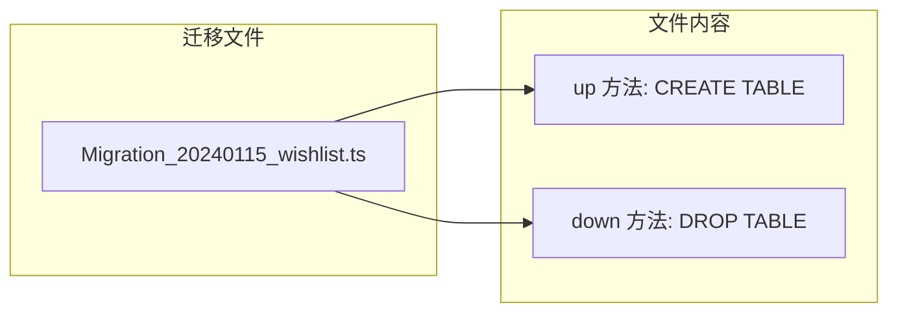

```typescript
// src/modules/wishlist/migrations/Migration_20240115_wishlist.ts
import { Migration } from "@mikro-orm/migrations"

export class Migration20240115Wishlist extends Migration {
  async up(): Promise<void> {
    this.addSql(`
      CREATE TABLE IF NOT EXISTS "wishlist" (
        "id" varchar NOT NULL,
        "customer_id" varchar NOT NULL,
        "product_id" varchar NOT NULL,
        "created_at" timestamptz NOT NULL DEFAULT now(),
        CONSTRAINT "wishlist_pkey" PRIMARY KEY ("id")
      );
    `)
    this.addSql(`
      CREATE INDEX "idx_wishlist_customer" ON "wishlist" ("customer_id");
    `)
  }

  async down(): Promise<void> {
    this.addSql(`DROP TABLE IF EXISTS "wishlist";`)
  }
}
```

### 3. 执行迁移

```bash
# 执行所有待处理迁移
medusa db:migrate
```

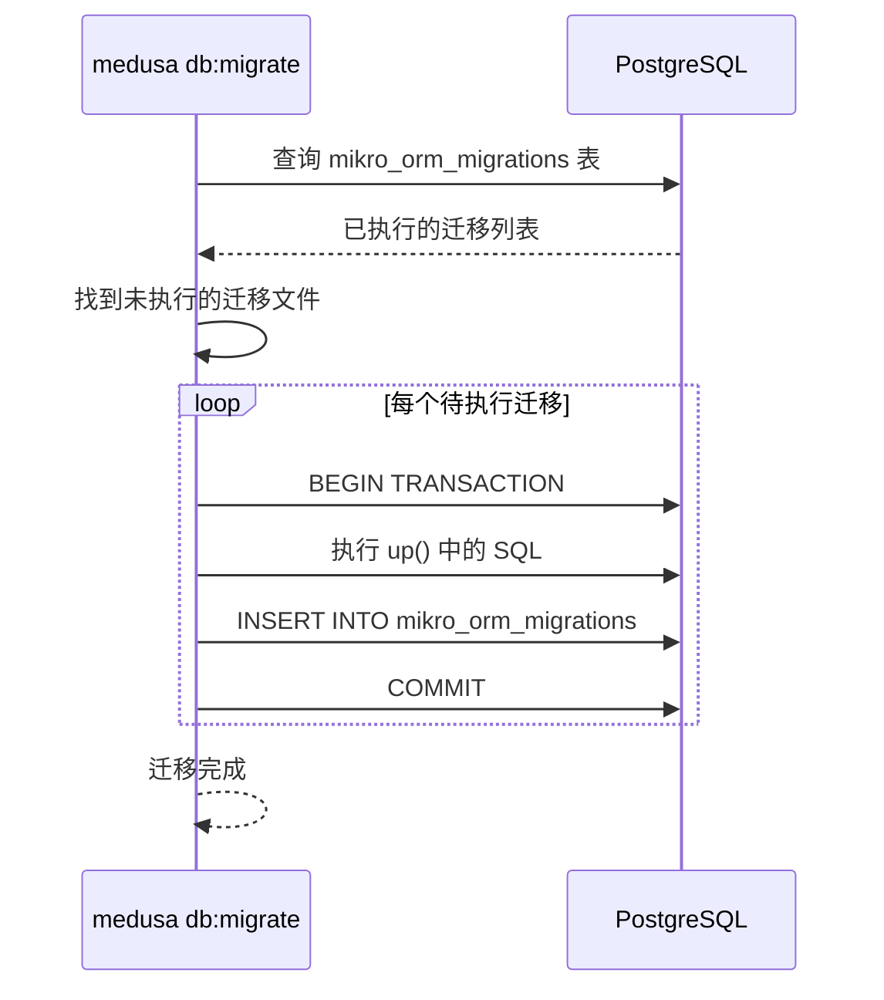

## 迁移版本控制

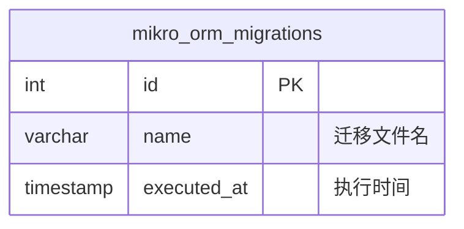

```sql
-- 查看已执行的迁移
SELECT * FROM mikro_orm_migrations ORDER BY executed_at;

-- 示例输出
--  id |              name                    |       executed_at
-- ----+--------------------------------------+------------------------
--   1 | Migration20240101_Initial            | 2024-01-01 10:00:00
--   2 | Migration20240115_Wishlist           | 2024-01-15 14:30:00
```

## 回滚操作

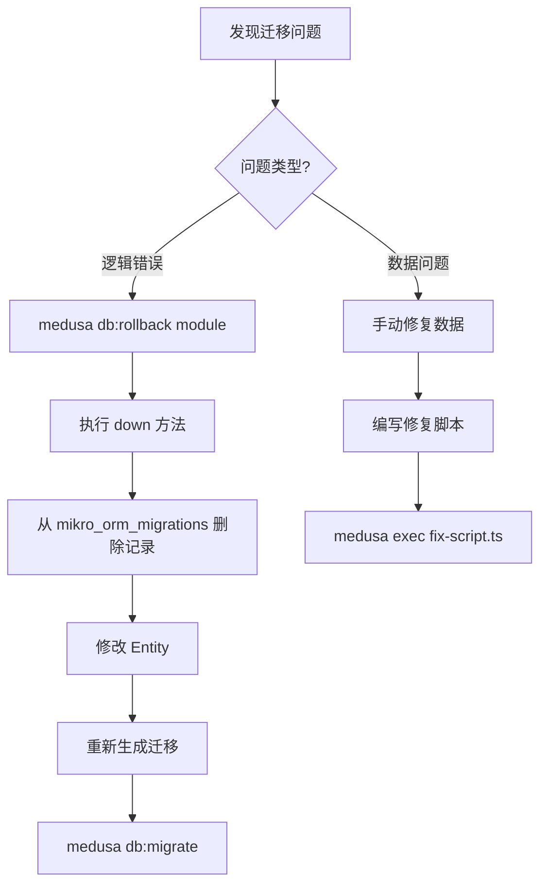

```bash
# 回滚特定模块的最后一批迁移
medusa db:rollback wishlist

# 回滚所有模块的最后一批迁移
medusa db:rollback
```

## 模块间链接（Links）

Medusa 使用 Links 系统处理模块间的关联：

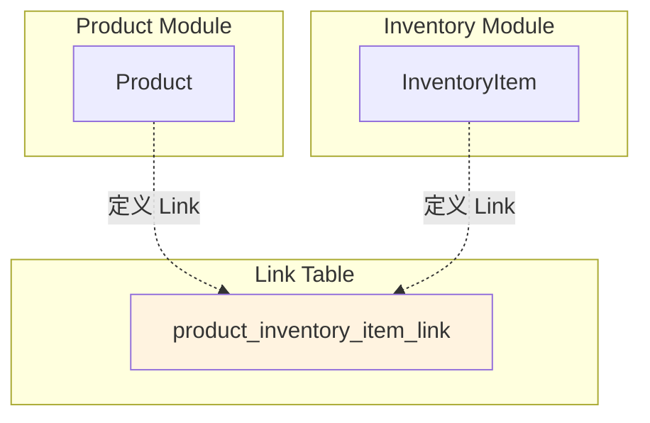

```bash
# 当添加或修改模块间链接后
medusa db:sync-links
```

## 部署流程对比

### 开发环境


### 生产环境

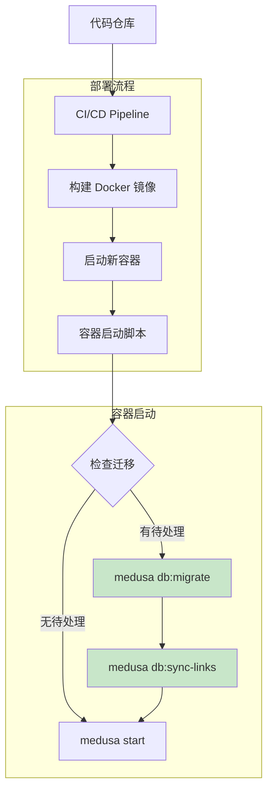

**推荐的启动脚本：**

```bash
#!/bin/bash
# entrypoint.sh

# 执行待处理迁移
medusa db:migrate

# 同步模块链接
medusa db:sync-links

# 启动服务
medusa start
```

## 与 Strapi 的对比总结

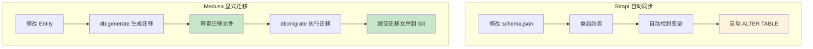

| 特性 | Strapi | Medusa |
|------|--------|--------|
| 迁移机制 | 自动同步 | 显式迁移文件 |
| 版本控制 | 无迁移文件 | 迁移文件提交到 Git |
| 回滚能力 | 无法回滚 | 支持 `db:rollback` |
| 审查机会 | 无 | 可审查 SQL |
| 团队协作 | 可能冲突 | 迁移文件合并 |
| 数据安全 | 不删除列 | 完全控制 |
| 适用场景 | 快速原型 | 生产级应用 |

## 最佳实践

### 1. 迁移文件命名

```
Migration_YYYYMMDD_ModuleName_Description.ts
```

### 2. 审查清单

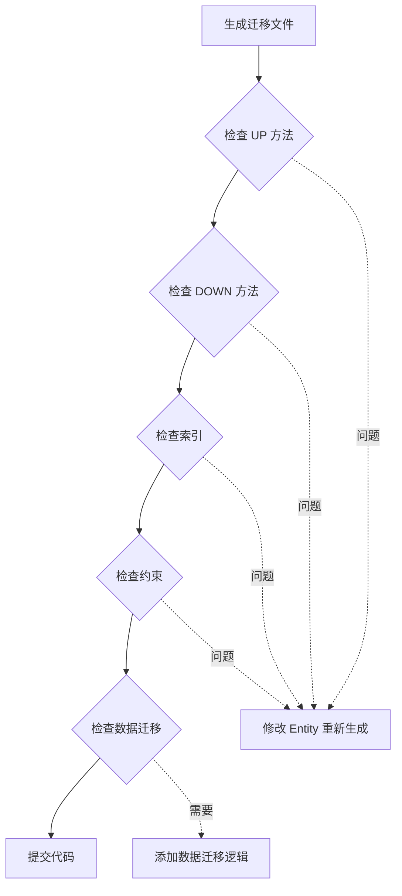

### 3. 生产部署检查

```bash
# 部署前在 staging 验证
medusa db:migrate --dry-run  # 如果支持

# 备份数据库
pg_dump -U medusa medusa_prod > backup_$(date +%Y%m%d).sql

# 执行迁移
medusa db:migrate

# 验证
psql -U medusa -d medusa_prod -c "\dt"
```

## 常见问题

### Q: 迁移文件冲突怎么办？

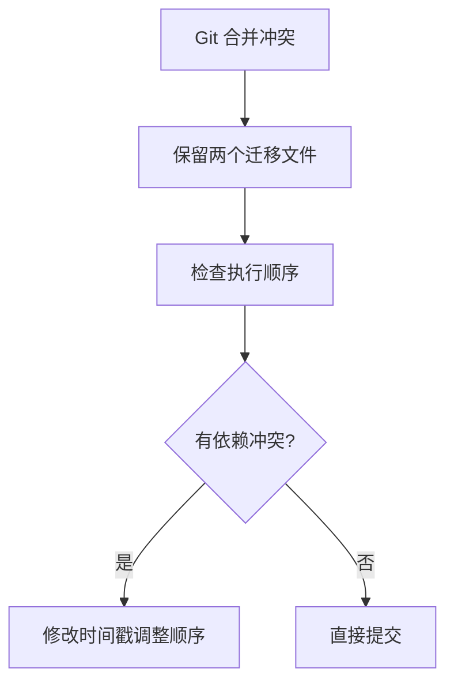

### Q: 如何迁移现有数据？

```typescript
// 在迁移文件的 up() 方法中
async up(): Promise<void> {
  // 1. 添加新列
  this.addSql(`ALTER TABLE "product" ADD COLUMN "sku" varchar;`)

  // 2. 迁移数据
  this.addSql(`UPDATE "product" SET "sku" = "handle" WHERE "sku" IS NULL;`)

  // 3. 设置约束
  this.addSql(`ALTER TABLE "product" ALTER COLUMN "sku" SET NOT NULL;`)
}
```

### Q: 如何跳过某个模块的迁移？

```bash
# 只迁移特定模块
medusa db:migrate --modules=product,order

# 生成特定模块的迁移
medusa db:generate product
```
