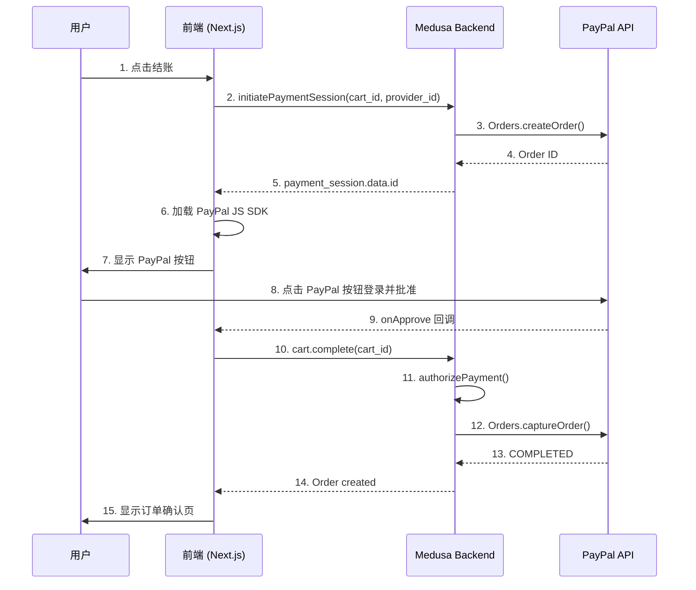
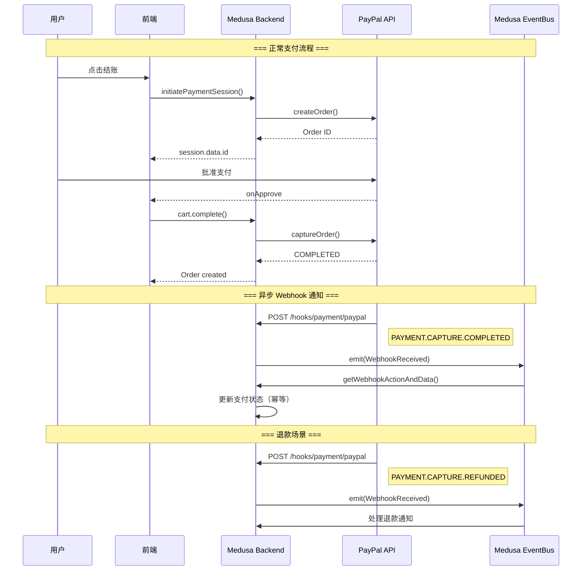
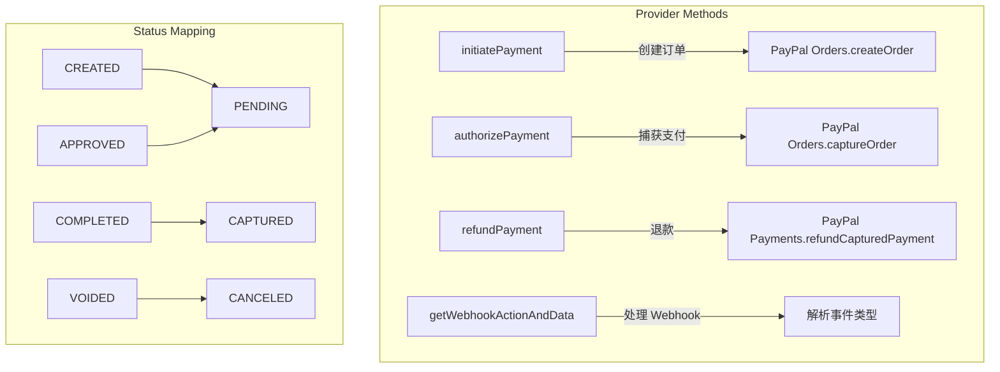
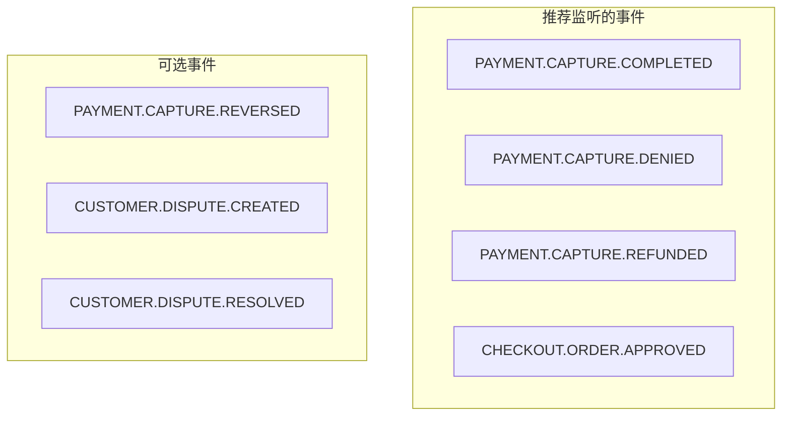
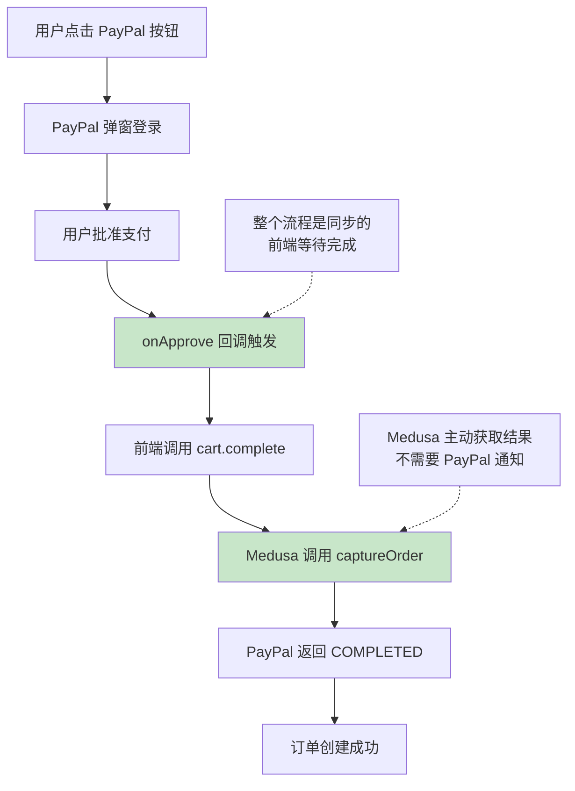
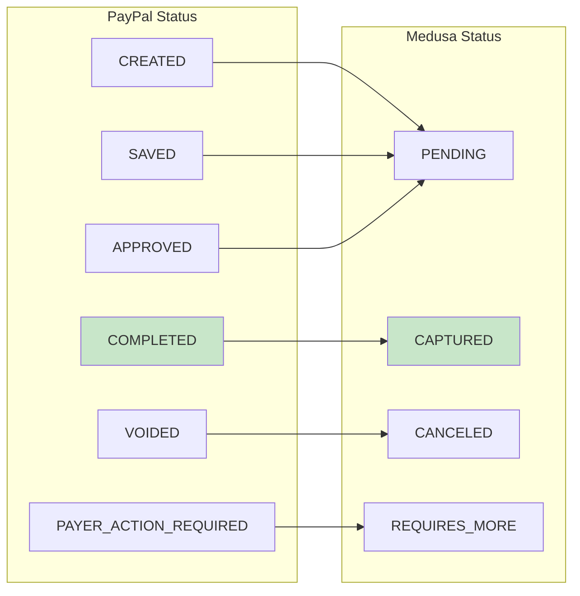
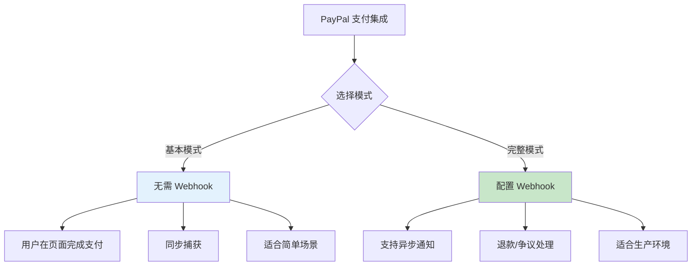

# PayPal 支付集成流程分析

## 概述

当前项目使用 `@rd1988/medusa-payment-paypal` 插件集成 PayPal 支付。本文档分析完整的支付流程，并回答是否需要在 PayPal 配置 webhook。

## 结论

**基本支付流程不需要配置 PayPal Webhook**，但生产环境**建议配置**以处理异步事件。

| 场景 | 是否需要 Webhook |
|------|------------------|
| 基本支付（用户在页面完成） | ❌ 不需要 |
| 退款通知 | ✅ 需要 |
| 争议/纠纷处理 | ✅ 需要 |
| 支付状态异步更新 | ✅ 建议 |

## 支付流程图

### 基本支付流程（无 Webhook）



**关键点**：
- 步骤 10-13 是同步的，Medusa 主动调用 PayPal 完成捕获
- 不需要 PayPal 回调通知
- 整个流程在用户会话中完成

### 带 Webhook 的完整流程



## 代码实现分析

### 1. PayPal Provider 配置

```typescript
// medusa-config.ts
{
  [Modules.PAYMENT]: {
    resolve: "@medusajs/medusa/payment",
    options: {
      providers: [
        {
          resolve: "@rd1988/medusa-payment-paypal",
          id: "paypal",
          options: {
            clientId: PAYPAL_CLIENT_ID,
            clientSecret: PAYPAL_CLIENT_SECRET,
            isSandbox: PAYPAL_IS_SANDBOX,  // true = sandbox, false = production
          },
        },
      ],
    },
  },
}
```

### 2. 支付流程核心方法



### 3. Medusa 内置 Webhook 端点

Medusa 自动提供 webhook 端点：

```
POST /hooks/payment/{provider}
```

对于 PayPal：

```
POST https://your-domain.com/hooks/payment/paypal
```

**处理流程**：

```mermaid
flowchart LR
    A[PayPal 发送 Webhook] --> B[/hooks/payment/paypal]
    B --> C[EventBus.emit<br/>WebhookReceived]
    C --> D[延迟 5 秒<br/>避免竞态]
    D --> E[getWebhookActionAndData]
    E --> F{action 类型}
    F -->|SUCCESSFUL| G[更新为已支付]
    F -->|FAILED| H[更新为失败]
    F -->|AUTHORIZED| I[更新为已授权]
```

### 4. Webhook 事件处理

```typescript
// PayPal Provider 的 getWebhookActionAndData 方法
async getWebhookActionAndData(webhookData) {
    const { resource, event_type } = webhookData;

    switch (event_type) {
        case "PAYMENT.CAPTURE.COMPLETED":
            return { action: PaymentActions.SUCCESSFUL, ... };

        case "PAYMENT.CAPTURE.DENIED":
        case "PAYMENT.CAPTURE.DECLINED":
            return { action: PaymentActions.FAILED, ... };

        case "CHECKOUT.ORDER.APPROVED":
            return { action: PaymentActions.AUTHORIZED, ... };

        case "PAYMENT.CAPTURE.REFUNDED":
            return { action: PaymentActions.SUCCESSFUL, ... };

        default:
            return { action: PaymentActions.NOT_SUPPORTED, ... };
    }
}
```

## 前端集成示例

```typescript
// 1. 初始化支付会话
const session = await sdk.store.payment.initiatePaymentSession(cartId, {
  provider_id: "pp_payment_paypal",  // pp_{module_id}_{provider_id}
});

// 2. 加载 PayPal SDK 并渲染按钮
const script = document.createElement('script');
script.src = `https://www.paypal.com/sdk/js?client-id=${PAYPAL_CLIENT_ID}&currency=USD&intent=capture`;
script.onload = () => {
  window.paypal.Buttons({
    // 使用 Medusa 创建的订单 ID
    createOrder: () => session.data.id,

    // 用户批准后完成订单
    onApprove: async () => {
      const order = await sdk.store.cart.complete(cartId);
      // 跳转到订单确认页
      router.push(`/order/${order.id}`);
    },

    onError: (err) => {
      console.error('PayPal error:', err);
    }
  }).render('#paypal-button-container');
};
document.body.appendChild(script);
```

## 配置 PayPal Webhook（可选但推荐）

### 步骤

1. 登录 [PayPal Developer Dashboard](https://developer.paypal.com/dashboard/)
2. 选择你的应用
3. 进入 **Webhooks** 部分
4. 添加 Webhook URL：

```
https://your-medusa-domain.com/hooks/payment/paypal
```

5. 选择要监听的事件：



### 环境对应

| 环境 | Webhook URL |
|------|-------------|
| Sandbox | `https://dev.your-domain.com/hooks/payment/paypal` |
| Production | `https://api.your-domain.com/hooks/payment/paypal` |

## 为什么基本流程不需要 Webhook？



**关键原因**：
1. 前端的 `onApprove` 回调在用户批准后**立即触发**
2. `cart.complete()` 是**同步调用**，等待 PayPal API 返回
3. Medusa 的 `authorizePayment` **主动调用** `captureOrder`
4. 不存在"等待 PayPal 通知"的场景

## 什么时候需要 Webhook？

| 场景 | 说明 | 需要 Webhook |
|------|------|--------------|
| 退款（从 PayPal 后台发起） | 商家在 PayPal 后台操作退款 | ✅ |
| 争议/纠纷 | 买家发起争议 | ✅ |
| 支付延迟（罕见） | 风控审核导致延迟 | ✅ |
| 网络中断恢复 | 用户支付完但前端断网 | ✅ |
| 正常支付流程 | 用户在页面完成支付 | ❌ |

## 状态映射表



## 总结



**推荐**：
- **开发/测试阶段**：可以不配置 Webhook
- **生产环境**：建议配置 Webhook 以处理边缘情况
