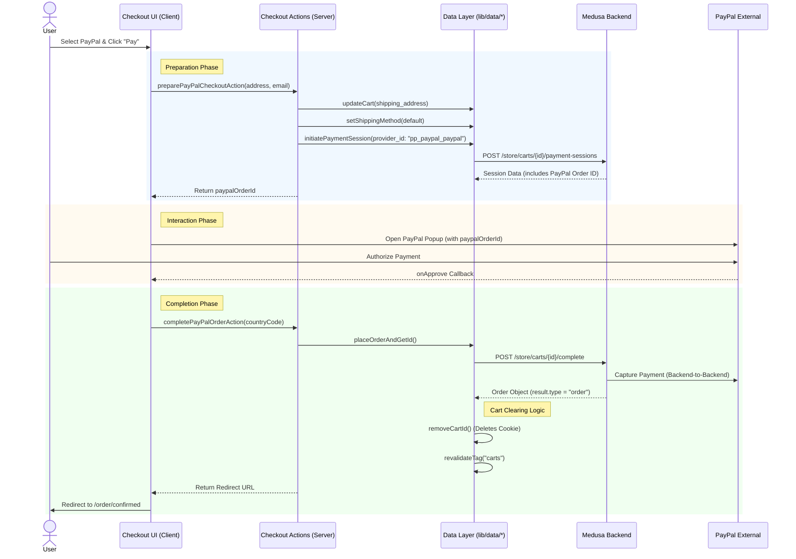

# PayPal Payment Flow & Cart Clearing Logic

This document details the execution flow of PayPal payments in the DJI Storefront and explains precisely how the shopping cart is cleared upon successful payment.

## Architecture Overview

The PayPal integration involves coordination between:
1.  **Client (Storefront)**: `CheckoutClient` and `PayPalButton` components.
2.  **Server Actions**: `preparePayPalCheckoutAction` and `completePayPalOrderAction`.
3.  **Medusa Backend**: Handles the `pp_paypal_paypal` provider and order creation.
4.  **PayPal Scripts**: `@paypal/react-paypal-js` handling the external popup.

## Execution Flow (Sequence Diagram)



## Detailed Analysis

### 1. Preparation Phase
**File:** `apps/dji-storefront/src/lib/actions/checkout.ts`

Before the PayPal popup opens, the system ensures the Medusa cart is fully ready.
*   **Validation**: Checks address fields.
*   **Sync**: Updates the cart address in Medusa via `updateCart`.
*   **Shipping**: Auto-selects the first available shipping option via `setShippingMethod`.
*   **Session**: Initializes the payment session. Crucially, Medusa communicates with PayPal to generate a `paypal_order_id`, which is passed back to the frontend.

### 2. The PayPal Interaction
**File:** `apps/dji-storefront/src/components/checkout/paypal-button.tsx`

The frontend uses the `PayPalButtons` component from `@paypal/react-paypal-js`.
*   It does **not** create the order itself; it uses the `paypalOrderId` generated by the server in step 1.
*   When the user approves the payment, the `onApprove` handler triggers the completion server action.

### 3. Order Completion & Cart Clearing
**File:** `apps/dji-storefront/src/lib/data/checkout.ts` (`placeOrderAndGetId` function)

This is where the transaction is finalized and the cart is "cleared".

#### How the Cart is Cleared
The "clearing" mechanism is a two-step process involving the backend state and the client session.

1.  **Backend State (Medusa)**:
    *   The `sdk.store.cart.complete(cartId)` call tells Medusa to finalize the transaction.
    *   Medusa attempts to capture the payment with PayPal.
    *   If successful, Medusa converts the **Cart** entity into an **Order** entity.
    *   The Cart is now considered "completed" in the database and cannot be modified further.

2.  **Client Session (Cookies)**:
    *   The function specifically calls `await removeCartId()`.
    *   **Source:** `apps/dji-storefront/src/lib/server/cookies.ts`
    *   **Action:** This deletes the `_medusa_cart_id` HTTP-only cookie.
    *   **Result:** The user's browser no longer has a reference to the old cart. When they browse for new products, `getOrSetCart` will find no cookie and create a brand new cart instance.

```typescript
// apps/dji-storefront/src/lib/data/checkout.ts

if (result.type === "order") {
  // 1. Clear the session
  await removeCartId() 

  // 2. Clear the cache
  revalidateTag("carts")
  revalidateTag("orders")

  // 3. Navigate away
  return { orderId: result.order.id, redirectUrl: ... }
}
```

### 4. Error Handling
*   If `completePayPalOrderAction` fails (e.g., capture fails), the `removeCartId()` is **not** called.
*   The user is returned to the checkout page.
*   The cart remains active in the session, allowing the user to try again or choose a different payment method.
