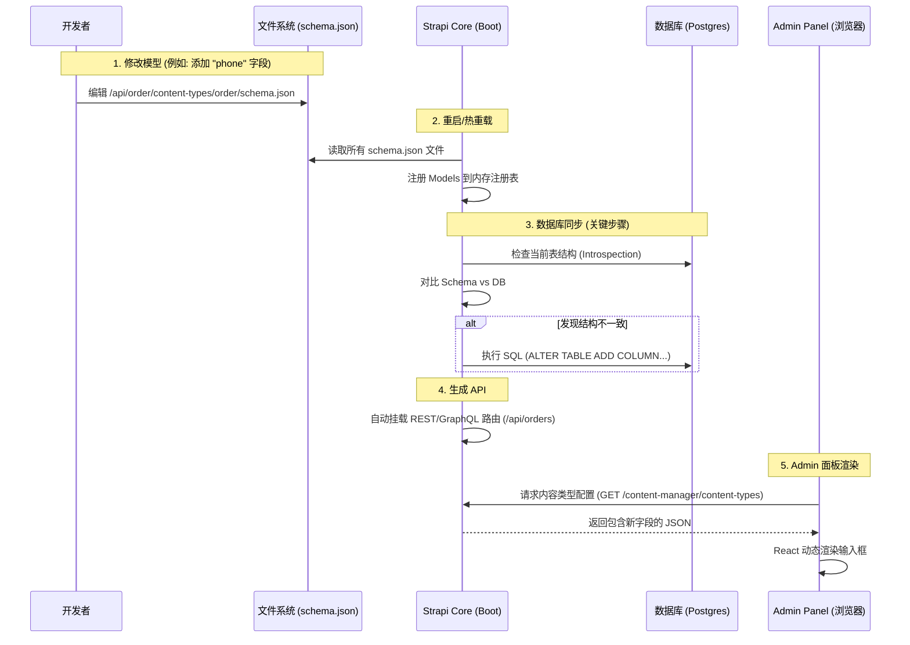

# Strapi 内容模型修改与启动生命周期解析

**最后更新**: 2026-01-13
**分类**: 架构原理 / Strapi

当在 Strapi 中修改了 `schema.json`（内容模型定义文件）并重启服务时，Strapi 会经历一个**从文件定义到数据库同步，再到动态生成 API 和 UI** 的过程。这是一个典型的 **Schema-First（模式优先）** 架构。

---

## 1. 核心启动流程概览

运行 `npm run develop` 或重启 Strapi 时，主要发生三个并行维度的变化：

1.  **内存层**：加载 JSON 配置到内存对象。
2.  **数据层**：ORM 对比差异，执行 `ALTER TABLE` 修改数据库结构。
3.  **表现层**：Content Manager（内容管理器）读取新配置，动态渲染 Admin 表单。



---

## 2. 深入解析：Admin 面板是如何“重新生成”的？

这是一个常见的误区。通常情况下，**修改 Content Type 不需要“重新编译”Admin 面板的构建文件（Webpack Build）**。

Strapi 的 Admin 面板是一个 **单页应用（SPA）**，它的“内容管理器”插件是非常通用的。它不会为每个模型写死 React 代码，而是**在运行时读取配置**。

### 渲染流程

```mermaid
flowchart TD
    subgraph Build_Time [构建阶段 (npm run build)]
        A[React 核心代码] --> B[Plugin 代码]
        B --> C[生成静态 JS/CSS bundle]
        Note1[只有安装新插件或修改 admin/src 时<br>才需要这一步]
    end

    subgraph Runtime_Time [运行时 (浏览器加载)]
        D[加载 Admin 面板 JS] --> E[登录 Admin]
        E --> F[点击 "Orders" 集合]
        F --> G{请求 Schema}
        G -->|API 调用| H[Strapi 后端读取 schema.json]
        H -->|返回 JSON 配置| I[前端 Content Manager]
        
        I --> J{解析字段类型}
        J -->|类型: String| K[渲染文本框组件]
        J -->|类型: Media| L[渲染图片上传组件]
        J -->|类型: Relation| M[渲染关联选择器]
    end
    
    C -.-> D
```

**关键点：**

*   **布局配置 (View Configuration)**: `schema.json` 定义了数据库层面的字段，而 UI 布局（如列表显示哪些列）存储在数据库的 `strapi_core_store_settings` 表中。
*   **重启行为**：添加新字段后，Strapi 通常会自动将其追加到编辑视图底部，但不会自动修改列表视图（需在 Configure the View 中手动调整）。

---

## 3. 数据库同步层 (Database Sync) 的底层逻辑

这是最核心且需谨慎的一步。Strapi 使用 ORM（通常是 Knex.js 包装层）管理数据。

```mermaid
graph TD
    A[启动 Boot] --> B[加载 Schema.json]
    B --> C{检查 strict 模式}
    C -->|Strict = true| D[报错: 数据库与模型不匹配]
    C -->|Strict = false (默认)| E[检查 DB 表是否存在]
    
    E -->|表不存在| F[CREATE TABLE]
    E -->|表存在| G[检查列 (Column) 是否存在]
    
    G -->|列不存在| H[ALTER TABLE ADD COLUMN]
    G -->|列类型变更| I[尝试转换类型 (如 int -> string)]
    G -->|Schema 中删除了字段| J[注意: 默认通常不会自动删除 DB 列]
    
    J --> K[保留废弃列以防数据丢失]
```

### 风险提示：字段重命名

如果您在 `schema.json` 中把 `title` 改名为 `headline`，Strapi **不会**知道这是重命名。它会认为：
1.  **删除**了 `title`（它不会删数据库里的列，数据保留但 API 读不到）。
2.  **新增**了 `headline`（创建一个新的空列）。

**结果**：看似数据丢失。
**解决**：需要编写数据库迁移脚本（Migration Script）将旧列的数据迁移到新列。

---

## 总结

1.  **模型文件 (`schema.json`)** 是真理之源（Source of Truth）。
2.  **重启时**，Strapi 根据这个真理，强行修改**数据库结构**以匹配文件。
3.  **Admin 面板** 不需要重新编译代码，它是动态的，像浏览器解析 HTML 一样解析您的 Schema JSON 并渲染出表单。
