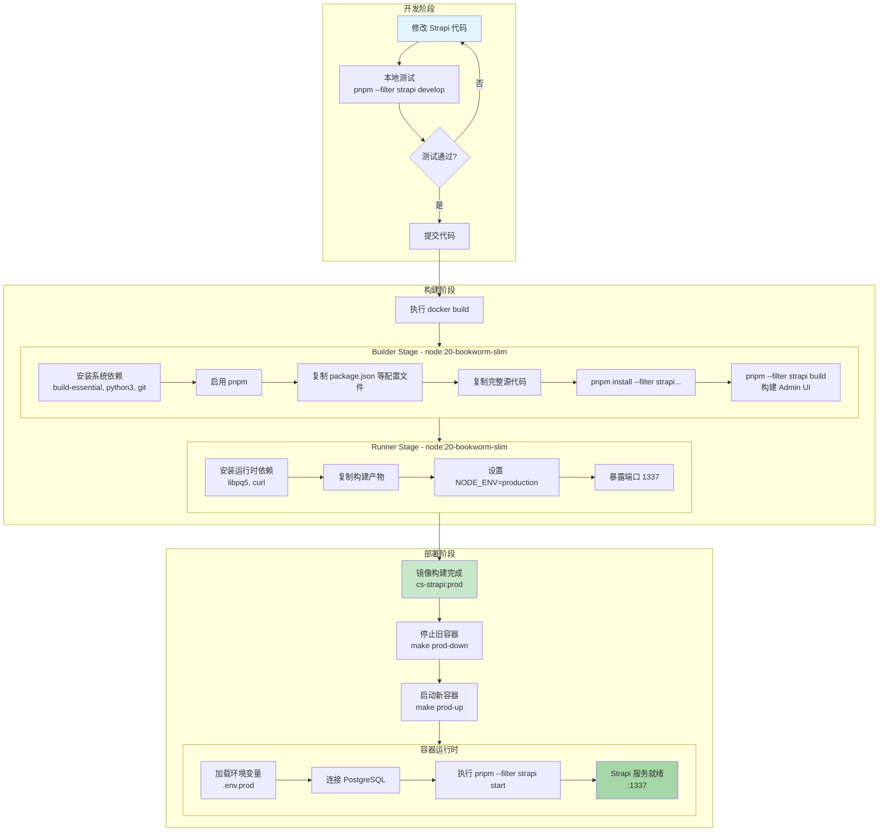
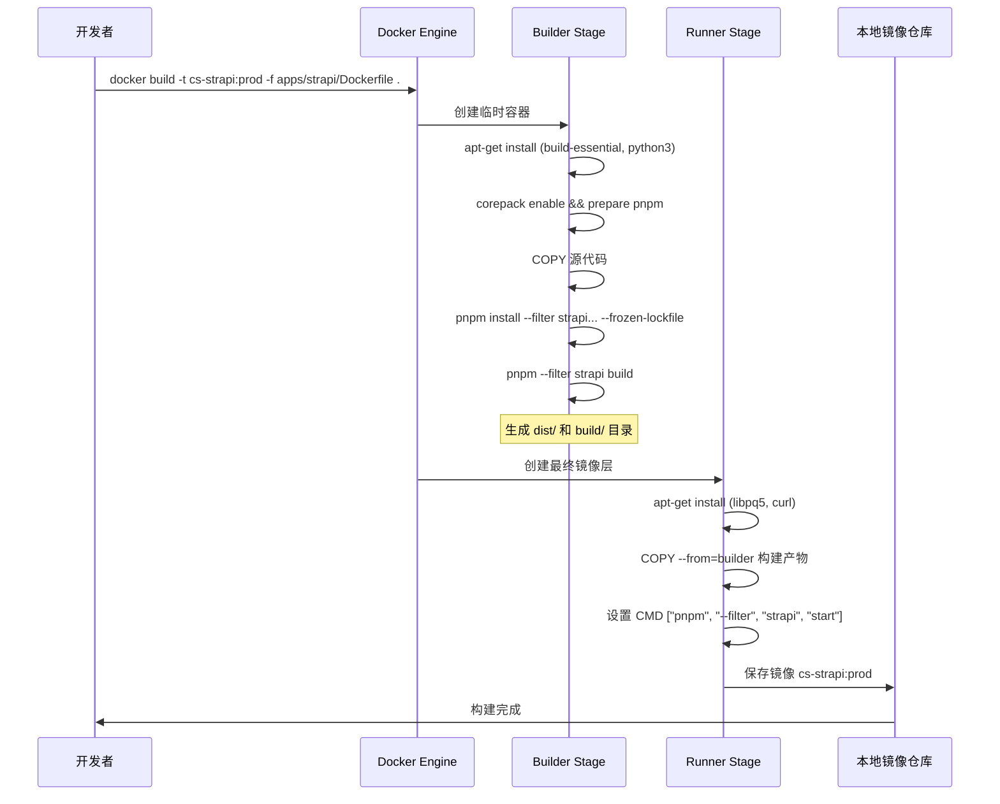
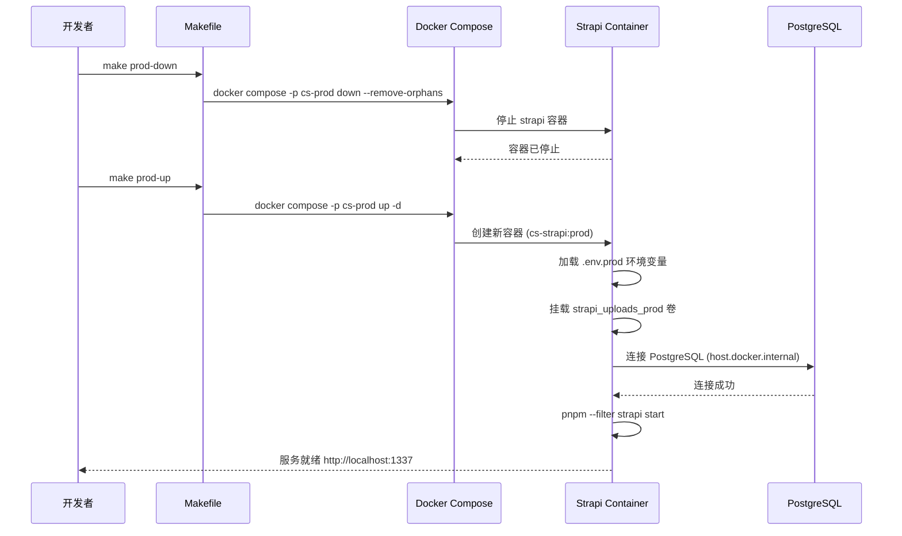
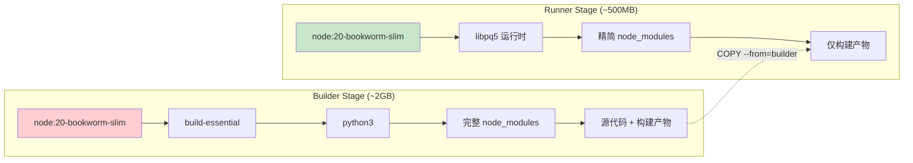
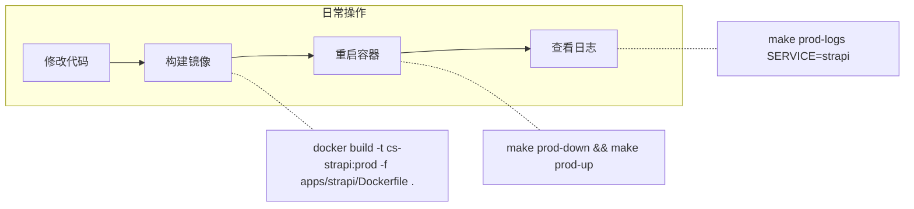

# Strapi 自定义模型修改后的构建部署流程

## 概述

当你修改 Strapi 自定义模型代码（如 `apps/strapi/src/api/` 下的内容类型、控制器、服务等）后，需要重新构建 Docker 镜像并重启容器才能生效。

## 完整流程图



## 执行命令详解

### 1. 构建镜像

```bash
# 在项目根目录执行（必须在根目录，因为需要 monorepo 上下文）
docker build -t cs-strapi:prod -f apps/strapi/Dockerfile .
```

**构建过程分解：**



### 2. 部署容器

```bash
# 停止并移除旧容器
make prod-down

# 启动新容器
make prod-up

# 或者一步完成（推荐）
make prod-down && make prod-up

# 查看日志确认启动成功
make prod-logs SERVICE=strapi
```

**部署过程分解：**



## Dockerfile 多阶段构建详解



**为什么使用多阶段构建？**

| 阶段 | 内容 | 作用 |
|------|------|------|
| Builder | build-essential, python3, 完整 devDependencies | 编译原生模块、构建 Admin UI |
| Runner | 仅运行时依赖 | 最小化镜像体积，减少攻击面 |

## 常用操作快速参考



### 完整命令序列

```bash
# 1. 构建新镜像
docker build -t cs-strapi:prod -f apps/strapi/Dockerfile .

# 2. 重启容器（使用新镜像）
make prod-down && make prod-up

# 3. 验证服务状态
make prod-logs SERVICE=strapi

# 4. 检查容器健康
docker ps | grep strapi
curl http://localhost:1337/_health
```

## 注意事项

1. **必须在项目根目录构建** - Dockerfile 需要访问 monorepo 的 `pnpm-workspace.yaml` 和 `packages/`
2. **环境变量来源** - 容器从 `deploy/gce/.env.prod` 读取配置
3. **数据库连接** - 容器内使用 `host.docker.internal` 访问主机 PostgreSQL
4. **uploads 持久化** - `strapi_uploads_prod` 卷保证上传文件不丢失
5. **构建缓存** - Docker 会缓存未变更的层，加速后续构建
