# Strapi 模型修改对数据库的影响

## 核心机制：自动同步（Auto-Sync）

Strapi v5 使用 **自动同步** 机制，而非传统的迁移文件（migration）。每次启动时，Strapi 会：

1. 读取 `schema.json` 中定义的模型
2. 与数据库中的实际表结构对比
3. **自动应用安全的变更**（如添加列）
4. **忽略危险的变更**（如删除列）


## 各类修改的影响矩阵

| 操作类型 | 数据库行为 | 现有数据 | 风险级别 |
|---------|-----------|---------|---------|
| **添加新字段** | 自动 `ADD COLUMN` | 安全，新记录默认 `NULL` | 🟢 低 |
| **添加新模型** | 自动 `CREATE TABLE` | 安全 | 🟢 低 |
| **删除字段** | **不会删除列** | 数据保留，代码不再访问 | 🟡 中 |
| **删除模型** | **不会删除表** | 数据保留 | 🟡 中 |
| **重命名字段** | 创建新列，旧列保留 | ⚠️ 旧数据不会迁移 | 🔴 高 |
| **修改字段类型** | 尝试 `ALTER COLUMN TYPE` | ⚠️ 可能转换失败 | 🔴 高 |
| **添加 required** | 无数据库变更 | ⚠️ 旧记录可能无法更新 | 🟡 中 |

## 详细场景分析

### 🟢 安全操作：添加新字段

```json
// schema.json 修改前
{
  "attributes": {
    "title": { "type": "string" }
  }
}

// schema.json 修改后
{
  "attributes": {
    "title": { "type": "string" },
    "subtitle": { "type": "string" }  // 新增
  }
}
```

**数据库变化：**
```sql
ALTER TABLE posts ADD COLUMN subtitle VARCHAR(255);
-- 现有记录的 subtitle 为 NULL
```


### 🔴 危险操作：重命名字段

```json
// 修改前
{ "attributes": { "title": { "type": "string" } } }

// 修改后 - 重命名为 name
{ "attributes": { "name": { "type": "string" } } }
```

**数据库变化：**
```sql
-- Strapi 的行为
ALTER TABLE posts ADD COLUMN name VARCHAR(255);
-- title 列仍然存在，但 Strapi 不再使用它
-- 数据没有迁移！
```


### 🔴 危险操作：修改字段类型

```json
// 修改前 - string 类型
{ "attributes": { "price": { "type": "string" } } }

// 修改后 - 改为 integer
{ "attributes": { "price": { "type": "integer" } } }
```

**可能的结果：**


### 🟡 中等风险：删除字段

```json
// 修改前
{
  "attributes": {
    "title": { "type": "string" },
    "deprecated_field": { "type": "string" }  // 要删除
  }
}

// 修改后 - 删除 deprecated_field
{
  "attributes": {
    "title": { "type": "string" }
  }
}
```

**数据库变化：**
```sql
-- Strapi 不会执行任何 SQL
-- deprecated_field 列仍然存在于数据库中
-- 但 Strapi API 不再返回该字段
```

## 生产环境安全操作流程

```mermaid
flowchart TD
    A[计划修改模型] --> B{修改类型?}

    B -->|添加字段/模型| C[直接修改 schema.json]
    B -->|删除字段| D[先确认无代码依赖]
    B -->|重命名字段| E[需要数据迁移]
    B -->|修改类型| F[需要数据迁移]

    C --> G[重新构建部署]
    D --> G

    E --> H[编写迁移脚本]
    F --> H

    H --> I[1. 添加新字段]
    I --> J[2. 迁移数据 SQL]
    J --> K[3. 部署新代码]
    K --> L[4. 验证数据]
    L --> M[5. 可选: 清理旧列]

    G --> N[服务重启自动同步]
    M --> N

    style E fill:#ffcdd2
    style F fill:#ffcdd2
```



## 手动数据迁移示例

当需要重命名字段或修改类型时，必须手动迁移：

```bash
# 1. 先连接数据库
psql -U strapi -d strapi_prod

# 2. 添加新列（通过修改 schema.json 并重启）

# 3. 迁移数据
UPDATE posts SET new_field_name = old_field_name;

# 4. 验证数据
SELECT COUNT(*) FROM posts WHERE new_field_name IS NULL AND old_field_name IS NOT NULL;

# 5. 可选：删除旧列（Strapi 不会自动做）
ALTER TABLE posts DROP COLUMN old_field_name;
```

## 组件（Component）的特殊处理

Strapi 的组件存储在独立的表中，通过关联表连接：


**组件修改的影响：**
- 修改组件字段 → 影响所有使用该组件的内容类型
- 删除组件 → 关联数据变成孤儿记录（不会自动删除）

## 最佳实践

### 开发环境

```bash
# 可以自由修改，使用 SQLite 方便重置
rm apps/strapi/.tmp/data.db
pnpm --filter strapi develop
```

### 生产环境


**关键检查清单：**

| 步骤 | 命令/操作 |
|------|----------|
| 备份数据库 | `pg_dump -U strapi strapi_prod > backup.sql` |
| 检查现有数据 | `SELECT COUNT(*) FROM affected_table;` |
| 部署后验证 | `curl http://localhost:1337/api/content-type` |
| 检查日志 | `make prod-logs SERVICE=strapi` |

## 总结

| 场景 | 推荐做法 |
|------|---------|
| 添加新功能 | 直接添加字段，安全 |
| 重命名字段 | 添加新字段 → 迁移数据 → 删除旧字段 |
| 修改字段类型 | 添加新字段 → 转换数据 → 删除旧字段 |
| 删除废弃字段 | 先从代码移除，表列可以保留 |
| 删除整个模型 | 先确认无依赖，表可以手动删除 |

**核心原则：Strapi 只做加法，不做减法。任何破坏性变更需要手动处理。**
