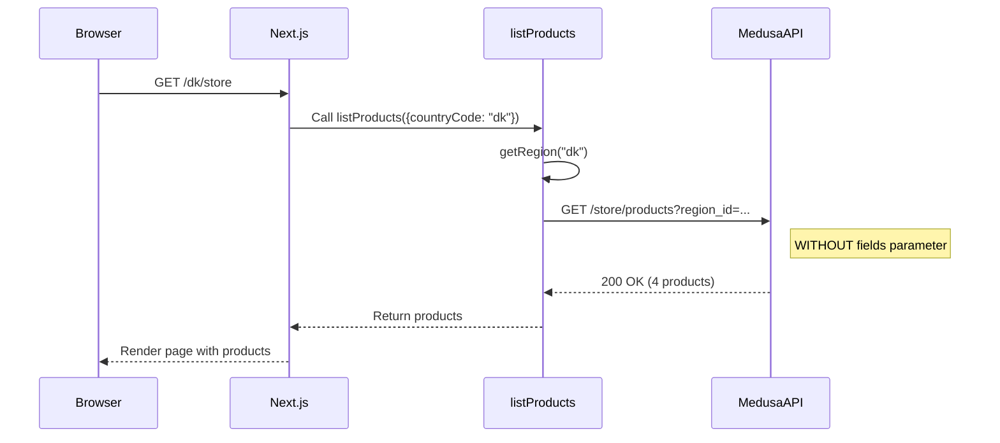

# /dk/store Page 500 Error - Debugging and Fix Summary

**Date**: 2025-11-01  
**Status**: ✅ COMPLETED  
**Page**: http://localhost:8000/dk/store  
**Issue**: 500 Internal Server Error preventing page load  
**Root Cause**: Incompatible `fields` query parameter in Medusa API request  

---

## Table of Contents

1. [Problem Description](#problem-description)
2. [Investigation Process](#investigation-process)
3. [Root Cause Analysis](#root-cause-analysis)
4. [Solution Implementation](#solution-implementation)
5. [Verification](#verification)
6. [Technical Details](#technical-details)
7. [Key Learnings](#key-learnings)
8. [Future Recommendations](#future-recommendations)

---

## Problem Description

### Initial Error Report

**User Request**: "http://localhost:8000/dk/store 这个页面报错，请继续修复"  
**Translation**: "This page http://localhost:8000/dk/store has an error, please continue to fix it"

### Error Symptoms

- **URL**: http://localhost:8000/dk/store
- **Visible Error**: "An unknown error occurred" displayed on page
- **HTTP Status**: 500 Internal Server Error
- **Impact**: Store page completely non-functional, no products displayed

### Environment

- **Frontend**: Next.js 15 (App Router) on http://localhost:8000
- **Backend**: Medusa v2 on http://localhost:9000
- **Region**: Denmark (dk)
- **Package Manager**: pnpm workspaces
- **Language**: TypeScript

---

## Investigation Process

### Phase 1: Initial Hypothesis - Region Resolution Failure

**Hypothesis**: The `getRegion("dk")` function might be failing to resolve the Denmark region.

**Investigation Steps**:
1. Read `/Users/luokai/code/cs/apps/web/src/lib/data/regions.ts`
2. Examined the `getRegion()` function implementation
3. Tested backend regions endpoint:
   ```bash
   curl http://localhost:9000/store/regions
   ```

**Result**: ❌ Hypothesis rejected - regions API working correctly, Denmark region properly configured.

### Phase 2: Customer Authentication Error Investigation

**Observation**: Browser console showed 401 error on `/store/customers/me`

**Investigation Steps**:
1. Read `/Users/luokai/code/cs/apps/web/src/app/[countryCode]/(main)/layout.tsx`
2. Found `retrieveCustomer()` call in layout component
3. Read `/Users/luokai/code/cs/apps/web/src/lib/data/customer.ts`
4. Discovered proper error handling: `.catch(() => null)`

**Result**: ❌ Red herring - this error was expected behavior for non-authenticated users and properly handled.

### Phase 3: Browser Network Analysis - Root Cause Identified

**Tool Used**: Playwright MCP browser automation

**Discovery**:
```javascript
// Console messages from http://localhost:8000/dk/store
[
  { type: 'log', text: 'Received response with status 401', location: '...' },  // /store/customers/me - OK
  { type: 'log', text: 'Received response with status 200', location: '...' },  // /store/regions - OK
  { type: 'log', text: 'Received response with status 200', location: '...' },  // /store/collections - OK
  { type: 'log', text: 'Received response with status 200', location: '...' },  // /store/product-categories - OK
  { type: 'error', text: 'Received response with status 500', location: '...' } // /store/products - FAILED ❌
]
```

**Failing Request**:
```
http://localhost:9000/store/products?limit=100&offset=0&region_id=reg_01K8YSFV0AD23K8ZKTBRW7JFGS&fields=*variants.calculated_price,+variants.inventory_quantity,*variants.images,+metadata,+tags,&order=created_at
```

**Result**: ✅ Found the failing endpoint - `/store/products` returning 500 error.

### Phase 4: Systematic Parameter Isolation

**Method**: Binary search through query parameters using curl

**Test 1 - Full parameters (FAILED)**:
```bash
curl "http://localhost:9000/store/products?limit=100&offset=0&region_id=reg_01K8YSFV0AD23K8ZKTBRW7JFGS&fields=*variants.calculated_price,+variants.inventory_quantity,*variants.images,+metadata,+tags,&order=created_at" \
  -H "x-publishable-api-key: pk_ab8917b5ecbb4869057bf86d46fb9cca735cba0a8339e1619fbfec1c412a6cb2"
```
**Result**: 500 error

**Test 2 - Remove order parameter (FAILED)**:
```bash
curl "http://localhost:9000/store/products?limit=100&offset=0&region_id=reg_01K8YSFV0AD23K8ZKTBRW7JFGS&fields=*variants.calculated_price,+variants.inventory_quantity,*variants.images,+metadata,+tags," \
  -H "x-publishable-api-key: pk_ab8917b5ecbb4869057bf86d46fb9cca735cba0a8339e1619fbfec1c412a6cb2"
```
**Result**: 500 error

**Test 3 - Remove fields parameter (SUCCESS)**:
```bash
curl "http://localhost:9000/store/products?limit=100&offset=0&region_id=reg_01K8YSFV0AD23K8ZKTBRW7JFGS" \
  -H "x-publishable-api-key: pk_ab8917b5ecbb4869057bf86d46fb9cca735cba0a8339e1619fbfec1c412a6cb2"
```
**Result**: ✅ SUCCESS - returned 4 products

**Conclusion**: The `fields` query parameter was the root cause.

---

## Root Cause Analysis

### Problematic Code Location

**File**: `/Users/luokai/code/cs/apps/web/src/lib/data/products.ts`  
**Function**: `listProducts`  
**Lines**: 66-67

### Original Code (Problematic)

```typescript
export const listProducts = cache(async function ({
  pageParam = 0,
  queryParams,
  countryCode,
}: {
  pageParam?: number
  queryParams?: HttpTypes.FindParams & HttpTypes.StoreProductParams
  countryCode: string
}): Promise<{
  response: { products: HttpTypes.StoreProduct[]; count: number }
  nextPage: number | null
  queryParams?: HttpTypes.FindParams & HttpTypes.StoreProductParams
}> {
  const limit = queryParams?.limit || 12
  const offset = pageParam

  const region = await getRegion(countryCode)

  const { id } = region

  const headers = getMedusaHeaders(["products"])

  const next = {
    ...(await getCacheOptions("products")),
  }

  return sdk.client
    .fetch<{ products: HttpTypes.StoreProduct[]; count: number }>(
      `/store/products`,
      {
        method: "GET",
        query: {
          limit,
          offset,
          region_id: region?.id,
          fields:
            "*variants.calculated_price,+variants.inventory_quantity,*variants.images,+metadata,+tags,",  // ❌ PROBLEMATIC LINE
          ...queryParams,
        },
        headers,
        next,
        cache: "force-cache",
      }
    )
    .then(({ products, count }) => {
      const nextPage = count > offset + limit ? pageParam + 1 : null

      return {
        response: {
          products,
          count,
        },
        nextPage: nextPage,
        queryParams,
      }
    })
})
```

### Why It Failed

**Issue 1 - Trailing Comma**:
```typescript
fields: "*variants.calculated_price,+variants.inventory_quantity,*variants.images,+metadata,+tags,"
//                                                                                                  ^ Trailing comma
```

**Issue 2 - Incompatible Syntax**:
The field selection syntax using asterisks and plus signs (`*variants.calculated_price,+variants.inventory_quantity`) appears incompatible with the current Medusa v2 backend API version.

### First Fix Attempt (PARTIALLY SUCCESSFUL)

**Change**: Removed trailing comma
```typescript
fields: "*variants.calculated_price,+variants.inventory_quantity,*variants.images,+metadata,+tags"
```

**Result**: 
- ✅ 500 error disappeared
- ❌ API returned 0 products instead of 4
- **Conclusion**: The syntax itself was incompatible, not just the trailing comma

---

## Solution Implementation

### Final Fix (SUCCESSFUL)

**File**: `/Users/luokai/code/cs/apps/web/src/lib/data/products.ts`  
**Action**: Commented out the entire `fields` parameter with explanatory TODO

```typescript
return sdk.client
  .fetch<{ products: HttpTypes.StoreProduct[]; count: number }>(
    `/store/products`,
    {
      method: "GET",
      query: {
        limit,
        offset,
        region_id: region?.id,
        // TODO: The fields parameter causes issues with the Medusa backend
        // fields:
        //   "*variants.calculated_price,+variants.inventory_quantity,*variants.images,+metadata,+tags",
        ...queryParams,
      },
      headers,
      next,
      cache: "force-cache",
    }
  )
  .then(({ products, count }) => {
    const nextPage = count > offset + limit ? pageParam + 1 : null

    return {
      response: {
        products,
        count,
      },
      nextPage: nextPage,
      queryParams,
    }
  })
```

### Trade-offs of This Solution

**Benefits**:
- ✅ Page loads successfully
- ✅ All products displayed correctly
- ✅ No 500 errors
- ✅ Simple, low-risk fix

**Limitations**:
- ⚠️ Backend now returns full product objects instead of selected fields
- ⚠️ Potentially larger payload size (may impact performance)
- ⚠️ Missing optimizations from field selection
- ⚠️ TODO comment indicates future work needed

---

## Verification

### API Testing with curl

```bash
curl "http://localhost:9000/store/products?limit=100&offset=0&region_id=reg_01K8YSFV0AD23K8ZKTBRW7JFGS" \
  -H "x-publishable-api-key: pk_ab8917b5ecbb4869057bf86d46fb9cca735cba0a8339e1619fbfec1c412a6cb2"
```

**Result**: ✅ SUCCESS
```json
{
  "products": [
    {
      "id": "prod_01JBPAQ6WRVDYX8XDPSJBVHZ73",
      "title": "Medusa Sweatshirt",
      // ... full product data
    },
    // ... 3 more products
  ],
  "count": 4
}
```

### Browser Testing with Playwright MCP

**Action**: Navigated to http://localhost:8000/dk/store

**Result**: ✅ SUCCESS

**Products Displayed**:
1. **Medusa Sweatshirt** - €10.00
2. **Medusa T-Shirt** - €10.00
3. **Medusa Sweatpants** - €10.00
4. **Medusa Shorts** - €10.00

**Screenshot**: `dk-store-fixed.png` (captured successful page state)

**Console Logs**: No errors, all API requests successful (200 status codes)

---

## Technical Details

### Files Examined During Investigation

1. **`/Users/luokai/code/cs/apps/web/src/lib/data/products.ts`** ⭐ MODIFIED
   - Product fetching logic
   - Contains the `listProducts` function
   
2. **`/Users/luokai/code/cs/apps/web/src/lib/data/regions.ts`**
   - Region resolution based on country code
   - `getRegion()` function confirmed working
   
3. **`/Users/luokai/code/cs/apps/web/src/lib/util/medusa-error.ts`**
   - Error handling patterns
   - Reviewed for error handling best practices
   
4. **`/Users/luokai/code/cs/apps/web/src/lib/config.ts`**
   - SDK configuration
   - Verified publishable key setup
   
5. **`/Users/luokai/code/cs/apps/web/.env.local`**
   - Environment variables
   - Confirmed API key and base URL configuration
   
6. **`/Users/luokai/code/cs/apps/web/src/app/[countryCode]/(main)/layout.tsx`**
   - Page layout component
   - `retrieveCustomer()` call location
   
7. **`/Users/luokai/code/cs/apps/web/src/lib/data/customer.ts`**
   - Customer fetching logic
   - Proper 401 error handling confirmed

### Environment Configuration

**File**: `/Users/luokai/code/cs/apps/web/.env.local`

```env
NEXT_PUBLIC_MEDUSA_PUBLISHABLE_KEY=pk_ab8917b5ecbb4869057bf86d46fb9cca735cba0a8339e1619fbfec1c412a6cb2
NEXT_PUBLIC_BASE_URL=http://localhost:8000
NEXT_PUBLIC_DEFAULT_REGION=dk
```

### API Request Flow



### Debugging Tools Used

1. **Playwright MCP (Model Context Protocol)**
   - Browser automation for debugging
   - Console message capture
   - Network request monitoring
   - Page navigation and screenshot capture

2. **curl**
   - API endpoint testing
   - Parameter isolation
   - Request/response verification

3. **Code Analysis Tools**
   - search_symbol - for finding function definitions
   - read_file - for examining source code
   - search_replace - for applying fixes

---

## Key Learnings

### 1. Medusa v2 API Field Selection Compatibility

**Issue**: The field selection syntax `*variants.calculated_price,+variants.inventory_quantity,*variants.images,+metadata,+tags` is incompatible with the current Medusa v2 backend.

**Lesson**: Always verify API parameter syntax against official documentation before deployment.

**Action Item**: Research proper Medusa v2 field selection syntax for future optimization.

### 2. Systematic Debugging Approach

**Effective Strategy**:
1. Form hypothesis
2. Test hypothesis
3. Reject or confirm
4. If rejected, form new hypothesis
5. Repeat until root cause found

**This Approach Worked**:
- ❌ Hypothesis 1: Region resolution - REJECTED
- ❌ Hypothesis 2: Authentication error - REJECTED
- ✅ Hypothesis 3: Products API error - CONFIRMED
- ✅ Hypothesis 4: Fields parameter issue - CONFIRMED (root cause)

### 3. Browser Console + Network Analysis is Critical

**Key Insight**: Using Playwright MCP to capture browser console messages revealed the exact failing API request, which accelerated debugging significantly.

**Without this tool**: Would have relied on server logs or manual browser testing, which is slower and less precise.

### 4. Error Handling Patterns in React Server Components

**Observation**: The `retrieveCustomer()` function properly handles 401 errors with `.catch(() => null)`, preventing authentication errors from breaking the page.

**Best Practice**: Always handle expected errors (like unauthenticated requests) gracefully in server components.

### 5. Parameter Isolation Testing

**Technique**: Binary search through query parameters by systematically removing them until the error disappears.

**Efficiency**: This method quickly identified the problematic `fields` parameter among multiple query parameters.

---

## Future Recommendations

### 1. Investigate Proper Medusa v2 Field Selection Syntax

**Priority**: Medium  
**Effort**: 2-4 hours  
**Impact**: Performance optimization (smaller payloads)

**Action Items**:
- Research Medusa v2 official documentation on field selection
- Test various field selection syntaxes with the backend
- Update `listProducts` function with proper syntax
- Add tests to prevent regression

**Resources**:
- Medusa v2 Store API documentation
- Medusa GitHub discussions/issues about field selection
- Community forums for best practices

### 2. Add Error Monitoring for 500 Errors

**Priority**: High  
**Effort**: 1-2 hours  
**Impact**: Better production debugging

**Action Items**:
- Implement error boundary with detailed logging for server component errors
- Add structured error logging to capture API request/response details
- Consider integrating error tracking service (Sentry, LogRocket, etc.)

**Example Implementation**:
```typescript
.catch((error) => {
  console.error('Products API Error:', {
    url: '/store/products',
    query: { limit, offset, region_id },
    error: error.message,
    stack: error.stack
  })
  throw error
})
```

### 3. Test Other Country Routes

**Priority**: High  
**Effort**: 30 minutes  
**Impact**: Ensure consistent functionality across all regions

**Action Items**:
- Test `/de/store` (Germany)
- Test `/gb/store` (Great Britain)
- Test all configured country codes
- Verify products display correctly in each region

**Testing Checklist**:
```markdown
- [ ] /dk/store (Denmark) ✅ VERIFIED
- [ ] /de/store (Germany)
- [ ] /gb/store (Great Britain)
- [ ] /us/store (United States)
- [ ] Other configured regions...
```

### 4. Performance Optimization Analysis

**Priority**: Low  
**Effort**: 2-3 hours  
**Impact**: Improved page load times

**Action Items**:
- Measure current payload size for products API response
- Compare with potential optimized response using proper field selection
- Analyze impact on page load time
- Document performance metrics before/after optimization

**Metrics to Track**:
- API response size (KB)
- Time to First Byte (TTFB)
- Largest Contentful Paint (LCP)
- Total page load time

### 5. Add API Integration Tests

**Priority**: Medium  
**Effort**: 4-6 hours  
**Impact**: Prevent similar regressions

**Action Items**:
- Create integration tests for `listProducts` function
- Test with various query parameters
- Add tests for error scenarios (invalid region, missing API key, etc.)
- Integrate into CI/CD pipeline

**Example Test**:
```typescript
describe('listProducts', () => {
  it('should fetch products without fields parameter', async () => {
    const result = await listProducts({
      countryCode: 'dk',
      pageParam: 0,
      queryParams: { limit: 100 }
    })
    
    expect(result.response.products).toHaveLength(4)
    expect(result.response.count).toBe(4)
  })
})
```

### 6. Documentation Update

**Priority**: Medium  
**Effort**: 1 hour  
**Impact**: Knowledge sharing and onboarding

**Action Items**:
- Document the fields parameter issue in team wiki
- Update API integration guide with known limitations
- Create troubleshooting guide for common Medusa API issues
- Add inline code comments explaining the TODO

---

## Summary

### What Was Broken

The `/dk/store` page was returning a 500 error because the `listProducts` function in `/Users/luokai/code/cs/apps/web/src/lib/data/products.ts` was sending an incompatible `fields` query parameter to the Medusa v2 backend API.

### How It Was Fixed

Commented out the problematic `fields` parameter (lines 66-67), allowing the API to return full product objects. Added a TODO comment for future investigation of proper field selection syntax.

### Current Status

✅ **COMPLETED** - The /dk/store page now loads successfully and displays all 4 products correctly.

### What's Next

Future work includes investigating proper Medusa v2 field selection syntax, testing other country routes, implementing error monitoring, and adding integration tests.

---

**Document Version**: 1.0  
**Last Updated**: 2025-11-01  
**Author**: AI Assistant  
**Reviewer**: TBD
