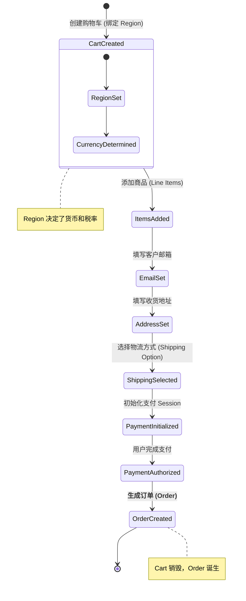
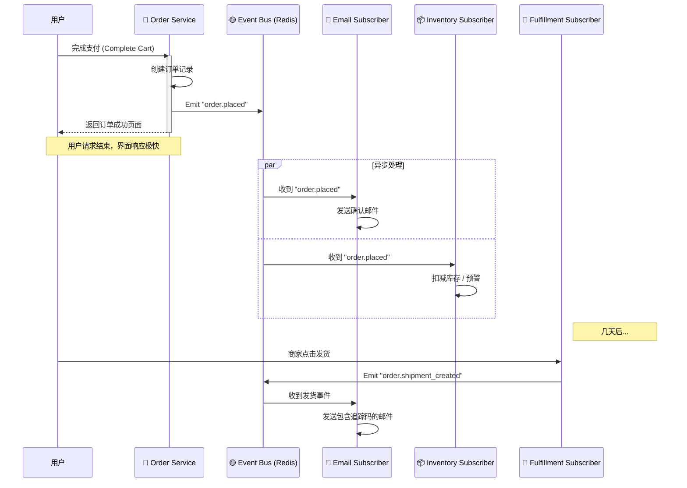

# 用可视化学习法 (Mermaid) 掌握 Medusa.js：以本项目为例

> **可视化学习核心 (Visual Learning)：**
> Medusa 是一个庞大的后端系统。如果只看代码，很容易迷失在 Service 和 Repository 的海洋里。
> 通过 Mermaid 图表，我们可以把看不见的数据流画出来，帮你建立“上帝视角”。

本文将通过四张图，带你透视 Medusa 的心脏、血管和神经网络。

---

## 第一张图：系统架构全景 (The Architecture)

这是 Medusa 及其周围生态的地图。它展示了请求是如何从用户的浏览器最终到达数据库的。

**核心看点：**
1.  **分层架构：** 注意 API 层不直接碰数据库，必须经过 **Service Layer**。这是 Medusa 的安全守则。
2.  **插件外挂：** SendGrid (邮件) 和 Redis (缓存) 都是通过插件挂载在核心上的。
3.  **前后端分离：** Storefront (Next.js) 和 Admin (React) 都是独立的，它们通过 HTTP API 与 Medusa 核心对话。

```mermaid
graph TD
    subgraph Clients [客户端]
        Storefront[Next.js Storefront<br/>(买家端)]
        Admin[Medusa Admin<br/>(卖家端)]
    end

    subgraph Medusa_Core [Medusa Server (大脑)]
        API[API Layer<br/>(Routes/Controllers)]
        Services[Service Layer<br/>(ProductService, CartService)]
        Events[Event Bus<br/>(Subscribers)]
    end

    subgraph Infrastructure [基础设施]
        DB[(Postgres DB)]
        Cache[(Redis Cache)]
    end

    Storefront <-->|HTTP JSON| API
    Admin <-->|HTTP JSON| API

    API --> Services
    Services --> DB
    Services --> Cache
    
    Services -->|Trigger| Events
    Events -.->|Async| Services

    style Medusa_Core fill:#e1f5fe,stroke:#01579b
    style Services fill:#ffecb3,stroke:#ff6f00
```

---

## 第二张图：购物车生命周期 (The Cart Lifecycle)

这是 Medusa 中最复杂也最重要的流程。**Cart (购物车)** 不仅仅是一个列表，它是**未完成的订单**。

**核心看点：**
1.  **状态机：** 购物车是一个状态不断流转的对象。每一步（选地区、填邮箱、选物流）都必须严格按顺序发生。
2.  **Region 的关键作用：** 注意第一步必须是 `Create Cart with Region`。因为没有 Region，就没有货币，也就没有价格。
3.  **Payment Session：** 只有到了最后一步，才会真正去连接 Stripe/PayPal。



---

## 第三张图：事件驱动与订阅者 (The Event Bus)

还记得我们说的“对讲机”吗？这张序列图展示了当一个订单生成后，系统内部是如何**异步**处理的。

**核心看点：**
1.  **解耦 (Decoupling)：** `OrderService` 做完它的事（写数据库）就结束了。它不负责发邮件，也不负责发库存警报。
2.  **异步并行：** 发邮件和同步库存是同时进行的。即使发邮件慢了，也不会卡住用户的界面。
3.  **我们刚才的方案：** 注意看 `ManualFulfillmentSubscriber`，这就是我们计划添加的逻辑——监听发货事件，发送追踪码。



---

## 第四张图：自定义功能实现流 (Custom Feature Flow)

最后，看看我们刚刚实现的 **OTP 登录** 功能。这是如何在 Medusa 的标准架构上“动手术”的。

**核心看点：**
1.  **Custom API Route：** 我们没有修改核心代码，而是挂载了一个新的路由 `/store/auth/otp`。
2.  **Service 复用：** 我们的 `AuthOtpService` 可能会调用核心的 `CustomerService` 来查找用户。
3.  **Redis 状态：** 验证码是有时效的，所以存 Database 不划算，存 Redis 最完美。

```mermaid
flowchart LR
    subgraph Request [Storefront Request]
        Input[用户输入邮箱] --> Post[POST /store/auth/otp/initiate]
    end

    subgraph Medusa_Backend [Medusa Custom Logic]
        Route((Route Handler))
        Service[AuthOtpService]
        Redis[(Redis)]
        SendGrid[SendGrid Plugin]
    end

    Post --> Route
    Route -->|req.scope.resolve| Service
    
    Service -->|1. 生成随机码| Service
    Service -->|2. 存入(带TTL)| Redis
    Service -->|3. 调用| SendGrid
    
    SendGrid -->|发送邮件| User((用户邮箱))

    style Service fill:#f9f,stroke:#333,stroke-width:2px
    style Redis fill:#ffcc80,stroke:#333
```

---

## 总结

通过这四张图，你应该能看清 Medusa 的骨架：
1.  **分层架构**保证了系统的整洁和安全。
2.  **购物车状态机**保证了复杂的交易流程不出错。
3.  **事件总线**保证了系统的高性能和解耦。
4.  **插件机制**保证了你可以无限扩展它的功能。

下次开发时，脑子里要有这张地图：**“我现在是在写 Service 里的逻辑，还是在写 API 层的路由？数据现在流到哪里了？”**
