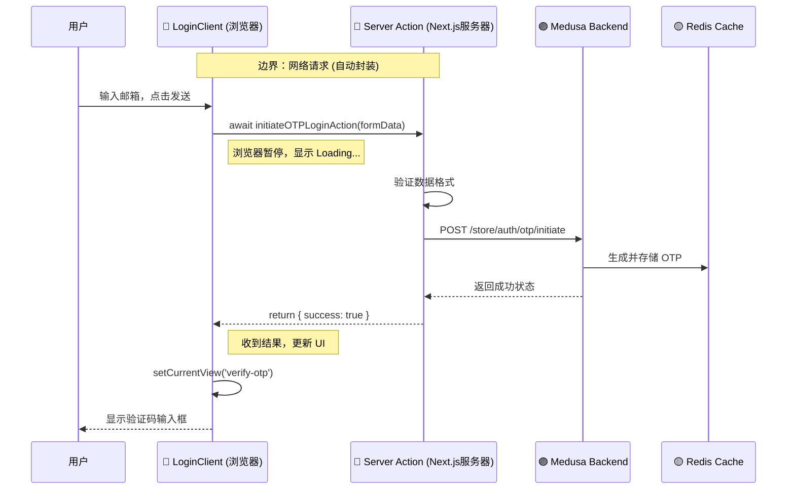

# 用可视化学习法 (Mermaid) 掌握 Next.js：以本项目为例

> **可视化学习核心 (Visual Learning)：**
> Next.js 的难点在于**“看不见的边界”**（Network Boundary）。
> 代码都写在一个文件里，但有的跑在服务器，有的跑在浏览器。
> 用 Mermaid 图表把这些边界画出来，你就能瞬间看透它的运行机制。

本文将通过三张核心图表，带你透视 `dji-storefront` 的内部构造。

---

## 第一张图：页面渲染流水线 (The Rendering Pipeline)

当你访问 `dji-storefront.com/us` 时，发生了什么？这张图展示了 Next.js 是如何把 URL 变成画面的。

**核心看点：**
1.  **路由解析：** 看到 `[countryCode]` 了吗？它像一个变量捕获器，把 `us` 抓出来传给页面。
2.  **嵌套布局 (Nested Layouts)：** `RootLayout` 包着 `StoreLayout`，最后才包着你的 `Page`。这就像洋葱一样一层层渲染。
3.  **RSC (React Server Components) Payload：** 服务器不直接发 HTML，而是发一种特殊的 JSON 数据流，浏览器拿到后像拼乐高一样把页面拼出来。

```mermaid
graph TD
    User((用户访问 /us)) --> Middleware[Middleware.ts<br/>(检查地区/重定向)]
    
    Middleware --> Routing{路由匹配}
    Routing -->|匹配| DynamicRoute["app/[countryCode]"]
    
    subgraph Server_Side [服务器端渲染 (SSR)]
        direction TB
        RootLayout[Root Layout<br/>(html, body)]
        StoreLayout[Store Layout<br/>(Nav, Footer)]
        Page[Page.tsx<br/>(Homepage)]
        
        DataFetch[(Medusa API<br/>获取商品数据)]
        
        RootLayout --> StoreLayout
        StoreLayout --> Page
        Page -.->|async await| DataFetch
    end
    
    Server_Side -->|RSC Payload + HTML| Browser[浏览器]
    
    subgraph Client_Side [客户端水合 (Hydration)]
        Browser --> Hydrate[React Hydration]
        Hydrate --> Interactive[变活了!<br/>按钮可以点击了]
    end
    
    style DynamicRoute fill:#f9f,stroke:#333
    style DataFetch fill:#bbf,stroke:#333
```

---

## 第二张图：组件树与服务端/客户端边界 (The Component Tree)

这是 Next.js 13+ 最重要的概念图。你的首页 (`src/app/[countryCode]/page.tsx`) 其实是一棵混合树。

**核心看点：**
1.  **红蓝分界：**
    *   **蓝色 (Server)：** `Homepage`, `Hero`。它们在服务器跑完就没了，发给浏览器的是纯 HTML。
    *   **红色 (Client)：** `ProductGrid`, `LoginClient`。它们在浏览器里活着，能响应点击。
2.  **数据流向：** 数据只能从**上往下**流，从 Server 流向 Client。你不能反过来把 Client 的 state 传给 Server Component（除非用 URL 参数）。
3.  **`'use client'` 的作用域：** 注意，一旦你用了 `'use client'`，这个组件**以及它导入的所有子组件**都会变成 Client Bundle 的一部分（除非特殊处理）。

```mermaid
graph TD
    subgraph Server_World [🔵 Server Components (后厨)]
        Page[Homepage<br/>(page.tsx)]
        Hero[SecondaryHero]
        LatestNews[LatestNews]
        
        Data[商品数据对象]
    end

    subgraph Client_World [🔴 Client Components (前厅)]
        ProductGrid[ProductGrid<br/>('use client')]
        LoginClient[LoginClient<br/>('use client')]
        InteractiveBtn[点击购买按钮]
    end

    Page -->|props: product| Hero
    Page -->|props: news| LatestNews
    
    %% 跨越边界
    Page == "JSON 序列化数据" ==> ProductGrid
    Page == "JSON 序列化数据" ==> LoginClient
    
    ProductGrid --> InteractiveBtn

    style Server_World fill:#e6f3ff,stroke:#333
    style Client_World fill:#ffe6e6,stroke:#333
    
    linkStyle 3,4 stroke-width:4px,stroke:orange;
```

---

## 第三张图：Server Actions 交互闭环 (The Interactive Loop)

刚才我们实现的 OTP 登录功能，其本质是一个**无 API 的交互闭环**。这张序列图展示了当你点击“发送验证码”时，数据是如何穿越时空的。

**核心看点：**
1.  **像调本地函数一样：** 在 `LoginClient` 里，你直接调用了 `initiateOTPLoginAction`。
2.  **隐形接口：** Next.js 自动帮你把这个调用变成了一个 `POST` 请求。
3.  **后端直连：** `initiateOTP` 运行在服务器上，所以它能直接连 Redis 和 Medusa，完全不需要通过浏览器暴露 API Key。



---

## 总结

通过这三张图，你应该能建立起 Next.js 的立体空间感：

1.  **纵向流程 (渲染)：** 从路由 -> 布局 -> 页面 -> 客户端水合。
2.  **横向切分 (架构)：** Server Component 负责数据，Client Component 负责交互，通过 Props 跨越边界。
3.  **循环交互 (Action)：** 通过 Server Actions 实现“浏览器 -> 服务器 -> 浏览器”的数据闭环。

下次写代码时，看着文件顶部，问自己：**“我现在是在蓝区（Server）还是红区（Client）？”**
