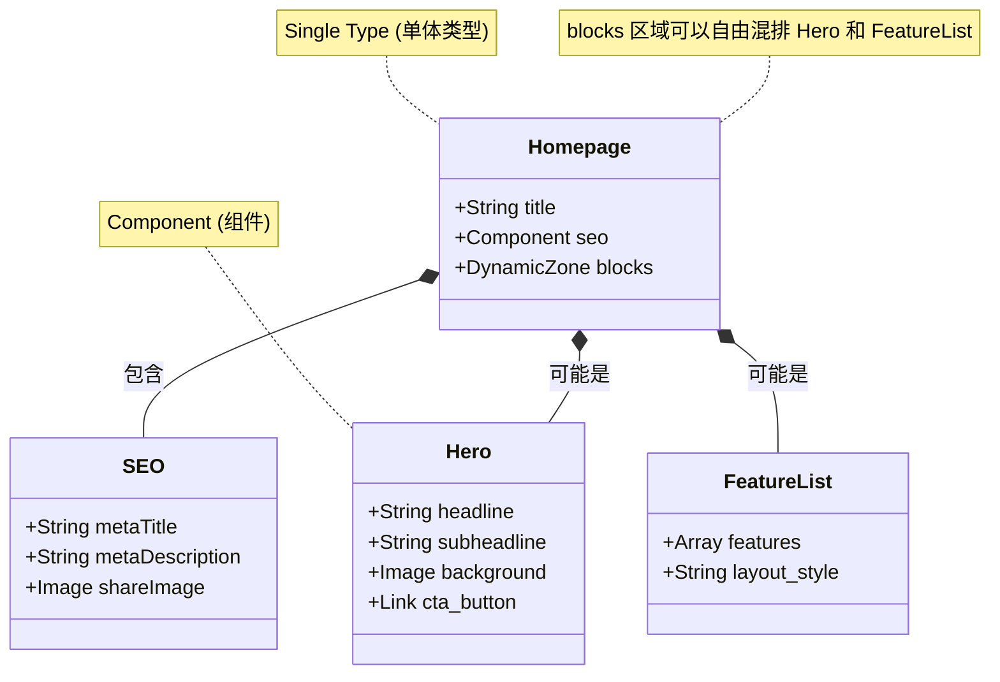

# 用可视化学习法 (Mermaid) 掌握 Strapi：以本项目为例

> **可视化学习核心 (Visual Learning)：**
> Strapi 不仅仅是一个数据库 UI。它是一套完整的**内容生产与分发流水线**。
> 用 Mermaid 画出这条流水线，你就能明白内容是如何从运营人员的指尖流向用户的屏幕的。

本文将通过四张图，带你透视 Strapi 在 `dji-storefront` 项目中的运作机制。

---

## 第一张图：内容生产流水线 (The Content Pipeline)

这张图展示了一篇博客文章是如何诞生的。

**核心看点：**
1.  **Draft/Publish 系统：** 注意中间的 `Published?` 判断。草稿状态的内容只有认证用户能看到，普通 API 访问会被过滤。
2.  **API 转换：** 数据库里的原始数据被 Strapi 转换成标准化的 JSON 格式。
3.  **Next.js 的角色：** 前端只是一个**消费者**，它通过 HTTP 请求拉取数据。

```mermaid
graph LR
    subgraph Editor [运营人员]
        Write[撰写内容]
        Save[保存草稿]
        Publish[点击发布]
    end

    subgraph Strapi_System [Strapi 后台]
        DB[(数据库)]
        API_Layer{权限检查}
        JSON_Gen[JSON 生成器]
    end

    subgraph Frontend [Next.js 前端]
        Fetch[fetch('/api/blogs')]
        Render[渲染页面]
    end

    Write --> Save
    Save --> DB
    Publish -->|标记状态: Published| DB

    Fetch --> API_Layer
    API_Layer -->|如果是草稿?| Block((拒绝访问))
    API_Layer -->|如果是发布?| JSON_Gen
    DB --> JSON_Gen
    JSON_Gen -->|Response| Render

    style API_Layer fill:#ffecb3,stroke:#ff6f00
    style Publish fill:#b2dfdb,stroke:#00695c
```

---

## 第二张图：动态组件架构 (The Component Architecture)

这是 Strapi 最强大的功能：**Dynamic Zones (动态区域)**。它允许你在页面上自由拼装组件，就像搭积木一样。

**核心看点：**
1.  **嵌套结构：** 一个页面 (`Page`) 包含 SEO 信息，同时包含一个动态区域 (`Blocks`)。
2.  **多态性：** `Blocks` 区域里可以放 Hero 组件，也可以放 Feature 组件。
3.  **前后端映射：** Strapi 里的每一个组件，在 Next.js 里都需要有一个对应的 React 组件来渲染它。



---

## 第三张图：双引擎驱动 (The Hybrid Engine)

你的商城 `dji-storefront` 是如何同时使用 Medusa 和 Strapi 的？这张图展示了数据的**聚合过程**。

**核心看点：**
1.  **并行获取 (Parallel Fetching)：** Next.js 同时向两个后端发起请求，互不阻塞。
2.  **职责分离：** Medusa 提供商品卡片数据，Strapi 提供营销横幅数据。
3.  **最终融合：** 在 React 组件层，这两股数据流汇合，渲染出一个完整的首页。

```mermaid
graph TD
    subgraph Client [用户浏览器]
        Page[访问首页 /]
    end

    subgraph NextJS [Next.js Server]
        Controller[Page Component]
        
        subgraph Data_Fetching [数据获取]
            Req1[getProducts()]
            Req2[getHeroBanner()]
        end
        
        Merge[Props Merging]
    end

    subgraph Backends [后端服务]
        Medusa[🔵 Medusa Engine]
        Strapi[🟣 Strapi CMS]
    end

    Page --> Controller
    Controller --> Req1
    Controller --> Req2

    Req1 <-->|JSON: Products| Medusa
    Req2 <-->|JSON: Content| Strapi

    Req1 --> Merge
    Req2 --> Merge
    
    Merge -->|Final HTML| Page

    style Medusa fill:#e1f5fe,stroke:#01579b
    style Strapi fill:#f3e5f5,stroke:#7b1fa2
```

---

## 第四张图：媒体资源链路 (The Media Pipeline)

为什么我们需要配置 `remotePatterns`？看这张图就懂了。

**核心看点：**
1.  **托管分离：** 图片通常不直接存数据库，而是存在磁盘或云存储（AWS S3）上。
2.  **URL 转换：** API 返回的是图片的 URL（如 `http://localhost:1337/uploads/img.jpg`）。
3.  **安全白名单：** Next.js 的 Image Optimization Server 会去下载这张图并进行压缩。为了防止被恶意利用去下载非法链接，它要求你必须在配置里把 `localhost:1337` (Strapi) 加入白名单。

```mermaid
flowchart LR
    Admin[运营上传图片] -->|Upload| Strapi
    
    subgraph Strapi_Server
        Plugin[Upload Plugin]
        Disk[(/public/uploads)]
        DB[(File Metadata)]
    end

    Admin --> Plugin
    Plugin -->|保存文件| Disk
    Plugin -->|记录路径| DB

    subgraph NextJS_Config
        Config[next.config.js]
        WhiteList[remotePatterns]
    end

    subgraph Rendering
        ImgTag[< Image src="..." >]
        Optimizer[Next.js Image Optimizer]
    end

    DB -.->|API Response| ImgTag
    ImgTag -->|Request| Optimizer
    Optimizer -->|Check Domain| WhiteList
    
    WhiteList -->|Allowed| Disk
    WhiteList -->|Blocked| Error((403 Forbidden))

    style WhiteList fill:#ffccbc,stroke:#d84315,stroke-width:2px,stroke-dasharray: 5 5
```

---

## 总结

通过这四张图，你应该对 Strapi 有了全新的认识：
1.  它是**内容流水线**的管理者 (Diagram 1)。
2.  它是**页面结构**的设计师 (Diagram 2)。
3.  它是**双引擎架构**中的副驾驶 (Diagram 3)。
4.  它是**媒体资源**的调度站 (Diagram 4)。

当你配置 `NEXT_PUBLIC_STRAPI_URL` 或设计一个新的 Content Type 时，脑海里浮现这些图表，你就知道每一步操作背后的意义了。
