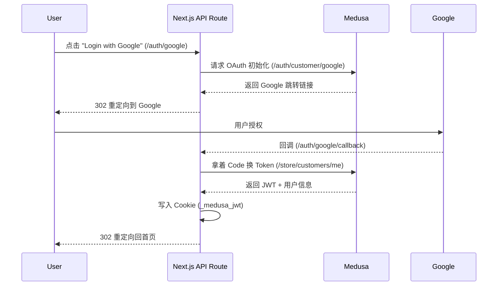

# DJI Storefront 与 Medusa 后端通信底层逻辑解析

**最后更新**: 2026-01-13
**适用版本**: Next.js 14+ / Medusa v2 (Client SDK)
**项目路径**: `apps/dji-storefront`

本文档深入解析 DJI Storefront (Next.js App Router) 如何与 Medusa 后端进行通信。本项目采用了 **Server Actions + SDK** 的混合模式，兼顾了 SEO、性能与安全性。

---

## 1. 架构概览

通信层主要由官方 SDK (`@medusajs/js-sdk`) 驱动，并被封装在 Next.js 的服务端组件和 Server Actions 中。

```mermaid
graph TD
    subgraph Frontend [DJI Storefront (Next.js)]
        Config[.env / src/lib/config]
        SDK[SDK Instance (src/lib/medusa.ts)]
        
        subgraph Server_Layer [Server Components / Actions]
            Fetchers[Data Fetchers (src/lib/data/*)]
            Actions[Server Actions (src/lib/actions/*)]
            CookieMgr[Cookie Manager (src/lib/server/cookies.ts)]
        end
        
        subgraph Client_Layer [Client Components]
            Hooks[React Hooks]
            UI[UI Components]
        end
        
        UI -->|Invoke| Actions
        Actions -->|Call| SDK
        Fetchers -->|Call| SDK
        SDK -->|Read| Config
    end

    subgraph Backend [Medusa Server]
        API[Rest API (/store/*)]
        Auth[Auth Module (/auth/*)]
        DB[(Postgres)]
    end

    SDK -- HTTP/JSON --> API
    API -- Read/Write --> DB
    
    Note over Frontend, Backend: 核心通信协议: HTTP + JSON
    Note over Frontend: 身份凭证: Publishable Key + JWT (Cookie)
```

---

## 2. 客户端初始化与配置

整个通信的核心入口位于 `src/lib/medusa.ts`。

### 2.1 初始化代码
```typescript
// src/lib/medusa.ts
import Medusa from "@medusajs/js-sdk"

export const sdk = new Medusa({
  baseUrl: process.env.MEDUSA_BACKEND_URL || "http://localhost:9000",
  debug: process.env.NODE_ENV === "development",
  publishableKey: process.env.NEXT_PUBLIC_MEDUSA_PUBLISHABLE_KEY,
})
```

### 2.2 关键环境变量
*   **`MEDUSA_BACKEND_URL`**: 后端 API 地址（如 `https://api.aidenlux.com`）。
*   **`NEXT_PUBLIC_MEDUSA_PUBLISHABLE_KEY`**: 必须提供的公钥 (PK)。Medusa v2 强制要求 PK 才能访问 Store API。
    *   *作用*: 确定当前请求属于哪个 Sales Channel (销售渠道)。

---

## 3. 身份认证与会话管理 (Cookie Strategy)

本项目不使用 LocalStorage 存储 Token，而是完全依赖 **HttpOnly Cookies**，以支持 Next.js 的服务端渲染 (SSR)。

### 3.1 核心 Cookies
| Cookie 名称 | 作用 | 生命周期 | 管理位置 |
| :--- | :--- | :--- | :--- |
| **`_medusa_jwt`** | 用户登录凭证 (Customer Auth) | 长期 | `src/lib/server/cookies.ts` |
| **`_medusa_cart_id`** | 当前购物车 ID | 临时 | `src/lib/server/cookies.ts` |
| **`_medusa_cache_id`** | 缓存控制标识 | 临时 | `src/middleware.ts` |

### 3.2 请求头注入
在 `src/lib/server/cookies.ts` 中，每次发起请求时，我们会自动从 Cookie 读取 JWT 并注入到 SDK 的请求头中：

```typescript
// 伪代码逻辑
const headers = {
  "x-publishable-api-key": process.env.NEXT_PUBLIC_MEDUSA_PUBLISHABLE_KEY,
}

if (token) {
  headers["authorization"] = `Bearer ${token}`
  // Medusa v2 特有头部
  headers["x-medusa-access-token"] = token
}
```

---

## 4. OAuth 登录流程 (Proxy Pattern)

本项目实现了一个特殊的 OAuth 代理流程，避免了传统的前端 Popup 混乱。

**路径**: `src/app/api/auth/[provider]/route.ts`



**设计亮点**: 所有敏感的 Token 交换都在服务端完成，浏览器只看到 Cookie 的设置，极大提高了安全性。

---

## 5. 数据获取模式 (Data Fetching)

本项目将数据获取逻辑分为两类：**读取 (Read)** 和 **写入 (Write)**。

### 5.1 读取数据 (src/lib/data/*)
用于页面渲染。通常在 Next.js 的 Server Components 中直接调用。

```typescript
// 示例: src/lib/data/products.ts
export const getProductByHandle = async (handle: string) => {
  return sdk.store.product.list({ handle })
    .then(({ products }) => products[0])
    .catch(medusaError)
}
```

*   **特点**: 直接返回数据对象，如果出错会通过 `medusaError` 抛出标准错误。
*   **缓存**: 依赖 Next.js 的 fetch cache，通过 `_medusa_cache_id` 进行标签化管理。

### 5.2 写入数据 (src/lib/actions/*)
用于表单提交（如加入购物车、登录）。使用 Server Actions 实现。

```typescript
// 示例: src/lib/actions/cart.ts
export async function addToCart(variantId: string, quantity: number) {
  const cartId = getCartId() // 从 Cookie 获取
  
  await sdk.store.cart.createLineItem(cartId, {
    variant_id: variantId,
    quantity
  })
  
  revalidateTag("cart") // 刷新缓存
}
```

---

## 6. 混合数据源：Medusa + Strapi

在某些页面（如商品详情页），我们需要同时获取 Medusa 的商品数据（价格、库存）和 Strapi 的 CMS 内容（富文本介绍）。

**路径**: `src/app/[countryCode]/products/[handle]/page.tsx`

```typescript
// 并行获取，提升性能
const [product, cmsContent] = await Promise.all([
  getProductByHandle(params.handle),
  getStrapiProductContent(params.handle)
])
```

这种模式确保了电商逻辑与内容运营的解耦，是 Headless Commerce 的典型应用。

---

## 7. 错误处理机制

位于 `src/lib/util/medusa-error.ts`。

由于 Medusa SDK 的错误对象较为复杂，我们封装了一个统一的错误处理器：

1.  **识别错误类型**: 区分网络错误、401 认证错误、400 校验错误。
2.  **标准化输出**: 将错误转化为前端可读的 Message 字符串。
3.  **安全过滤**: 隐藏敏感的堆栈信息 (Stack Trace)。

---

## 8. 调试指南

如果在开发中遇到 API 通信问题，可以检查以下几点：

1.  **Publishable Key**: 检查 `.env` 中的 `NEXT_PUBLIC_MEDUSA_PUBLISHABLE_KEY` 是否与 Medusa Admin 后台一致。
2.  **Cookie**: 打开浏览器 DevTools -> Application -> Cookies，查看 `_medusa_jwt` 是否存在。
3.  **Debug API**: 访问 `/api/debug` 路由，系统会自检并返回当前的环境变量和连接状态。
