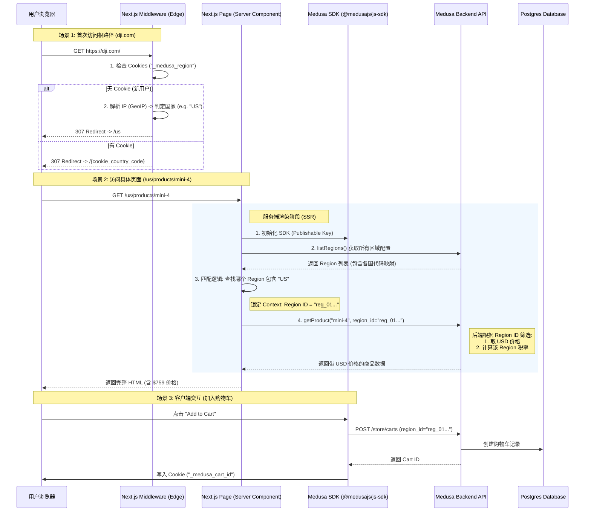

# Medusa 网站客户访问全流程解析

**最后更新**: 2026-01-13
**核心议题**: 前端如何判定用户区域并与 Medusa 建立关联。

---

## 1. 核心逻辑概览

在 Medusa + Next.js 架构中，**“区域 (Region)”是最高优先级的上下文**。所有的商品价格、运费、税率都必须在一个确定的 Region 下才有意义。

前端主要通过以下两种方式确定用户区域：
1.  **URL 路径 (强强制)**: 如 `/us/products` 明确指定美国，`/de/products` 明确指定德国。
2.  **IP 地理定位 (中间件)**: 如果用户访问根路径 `/`，Next.js 中间件会根据 IP 自动重定向到最合适的国家代码。

---

## 2. 详细访问流程图 (Mermaid)

---

## 3. 关键步骤深度解析

### A. 区域判定 (The "Router" Phase)
这是最关键的一步。在 `apps/dji-storefront/src/middleware.ts` 中实现。

*   **逻辑**: 当用户访问 `/` 时，我们**不提供内容**，只做**分流**。
*   **优先级**:
    1.  **Cookie**: 用户上次选过 "Germany" 吗？选过就跳 `/de`。
    2.  **GeoIP**: 用户的 IP 是法国的吗？是就跳 `/fr`。
    3.  **Fallback**: 都不行？跳默认的 `/us`。

### B. 上下文关联 (The "Context" Phase)
一旦 URL 确定为 `/us`，Next.js 的页面组件 (`src/app/[countryCode]/page.tsx`) 就会拿到参数 `params.countryCode = "us"`。

*   **Medusa 关联**:
    *   前端拿着 `"us"` 去问 Medusa：“谁是包含 US 的 Region？”
    *   Medusa 答：“是 `reg_north_america`。”
    *   前端**必须**在后续所有 API 请求（查商品、查运费、建购物车）中带上这个 `region_id`。

### C. 价格透出 (The "Pricing" Phase)
这是为什么“不同区域看不同价格”能生效的原因。

*   **错误做法**: `GET /products/123` (不带参数)。Medusa 会蒙圈，不知道返给你哪个价格（因为它有 USD, EUR, GBP...）。
*   **正确做法**: `GET /products/123?region_id=reg_north_america`。Medusa 明确知道：“哦，你要北美区的价格，给你 $759。”

---

## 4. 总结

前端与 Medusa 后台的关联核心在于 **"Country Code -> Region ID"** 的映射。

1.  **入口**: URL 中的 Country Code (`/us`, `/de`) 是用户意图的直接体现。
2.  **桥梁**: 中间件和页面逻辑将 Country Code 翻译成 Medusa 能听懂的 Region ID。
3.  **结果**: 整个商城的“时空”（货币、价格、物流）随之切换。
